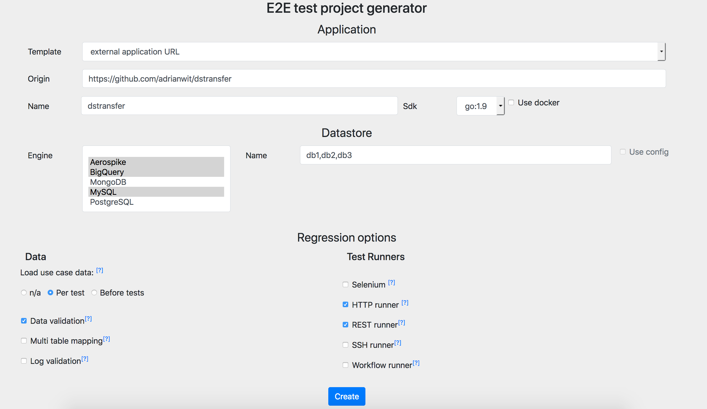

# Declarative end to end functional testing (endly)

[](https://goreportcard.com/report/github.com/viant/endly)
[](https://godoc.org/github.com/viant/endly)

This library is compatible with Go 1.10+

Please refer to [`CHANGELOG.md`](CHANGELOG.md) if you encounter breaking changes.

- [Motivation](#Motivation)
- [Introduction](#Introduction)
- [Getting Started](#Getting-Started)
- [Documentation](#Documentation)
- [License](#License)
- [Credits and Acknowledgements](#Credits-and-Acknowledgements)


## Motivation

_An end to end testing_ is a methodology which comprehensively tests an application in the environment closely imitating production system with all network communication, user, datastore and other dependencies interaction.

It takes great length to manually prepare an application and its data for testing. And it can be serious bottleneck if this process is manual or relies on the 3rd party.
Complex regression test plan execution and data organization can be yet additional challenge with hundreds business use cases to test. 

While there are many great frameworks selection helping with an integration testing: 

web UI integration testing: 
 - [Selenium](https://www.seleniumhq.org/)
 - [Cypress.io](https://www.cypress.io/) 
 - [Procrator](https://www.protractortest.org/)

or database integration testing:
 - [dbunit](http://dbunit.sourceforge.net/)
 - [dsunit](http://github.com/viant/dsunit)

or application build and deployment:
 - [Docker](https://www.docker.com/)

None of these tools on its own have a comprehensive end to end testing and automation capabilities. 
What is worst some of these tools are coupled with a particular frameworks or specific language.

Endly takes declarative approach to test an application written in any language. The testing weight moves towards input and desired application output definition.
This framework provides an ability to maintain and operate on hundreds of use cases effectively and cohesively, on top of that it can also automate system, data and application preparation related tasks.
Endly can easily orchestrate e2e testing process of n-tier distributed application where backend, middleware and front-end each uses different stack.


Some typical e2e testing tasks supported by **endly**:
- Local or remote system preparation including all services required by the application (with or without docker).
- Checking out the application code
- Building and deploying the application (with or without docker).
- Database and data preparation
- Setting application state 
- Regression test execution (HTTP, REST, Selenium)
- Data and application output verification (UI changes, transaction logs, database changes)


<a name="introduction"></a>

## Introduction

Endly uses a generic workflow system to automate development and testing processes. 
Each process defines a sequence of task and actions.
While a task act like a grouping element, an action does the actual job.
For instance a regression test task; it may involve many small activities like
sending HTTP request and checking response, validating database state,
validating log records produced by the application, etc. 

Various endly services expose a set of actions that can be directly invoked by a user-defined workflow. 

Imagine _an application build task_, which may involve the following
- code checkout
- setting up SDK 
- setting build tools
- setting environment
- build an app 

An endly workflow accomplishing this task  may look like the following:

```yaml
init:
  xxCredentials: ${env.HOME}/.secret/secret.json
  appPath: $WorkingDirectory(../)
  target:
    URL: ssh://127.0.0.1/
    credentials: localhost
pipeline:
  build-app:
    checkout:
      action: version/control:checkout
      origin:
        URL: https://github.com/some_repo/app
      dest:
        URL: $appPath
    set_sdk:
      set_jdk:
        action: sdk:set
        sdk: jdk:1.8
      set_build_runner:
        action: deployment:deploy
        appName: maven
        version: 3.5
      set_env:
        action: exec:run
        target: $target
        commands:
          - export XXX_CREDENTIALS=$xxCredentials
    get-schema:
      action: storage:copy
      source:
        URL: https://raw.githubusercontent.com/some_repo/db/schema.sql
      dest:
        URL: $appPath/schema.sql
    build:
      action: exec:run
      request: '@build.yaml'
       
```

@build.yaml
```yaml
target: $target
commands:
  - echo 'building app'
  - cd $appPath
  - mvn clean test
```

In the following inline workflow, I have used
 - version/control service with checkout operation
 - sdk service with set operation
 - deployment service with deploy operation
 - storage service with copy operation
 - exec service with run operation

Endly exposes services in the RESTful manner, where each service provides a list of supported operation alongside with corresponding contracts.
Any service request can be defined either directly within workflow or delegated to external request file using YAML or JSON format. 

For instance to find out what request/response contract is supported by exec:run (which uses SSH session) you can simply run 

```bash
endly -s=exec -a=run
```

The following command provide list of currently supported endly services
```bash
endly -s='*'
```

While the above build task example was a trivial workflow usage, the power of endly comes with 
- flexible workflow definition
- workflow reusability
- full stateful workflow execution control (i.e., defer task, on error task, loops, switch/case, concurrent action execution etc)
- ability to organize regression workflow with thousands of use cases in a cohesive manner
- ability to comprehensively control testing application state
- flexible service architecture


## Getting Started


##### Installation
  - [Install/Download](doc/installation)
  - [Endly docker image](docker/)


#####  Project generator
 
Good workflow and data organization is the key for success, e2e project generator is the great place to start.

- [Create test project for your app](doc/generator). [](http://endly-external.appspot.com/)


##### Examples:


**a) System preparation**

For instance: the following define inline workflow to prepare app system services:

@system.yaml
```yaml
tasks: $tasks
defaults:
  target: $serviceTarget
pipeline:
  destroy:
    stop-images:
      action: docker:stop-images
      images:
        - mysql
        - aerospike
  init:
    services:
      mysql:
        workflow: "service/mysql:start"
        name: mydb3
        version: $mysqlVersion
        credentials: $mysqlCredentials
        config: config/my.cnf
      aerospike:
        workflow: "service/aerospike:start"
        name: mydb4
        config: config/aerospike.conf
```


**b) Application build and deployment** 

For instance: the following  define inline workflow to build and deploy a test app:
(you can easily build an app for standalone mode or in and for docker container)


**With Dockerfile build file and docker compose**

@app.yaml
```yaml
tasks: $tasks
init:
- buildPath = /tmp/build/myapp/
- version = 0.1.0
defaults:
  app: myapp
  version: 0.1.0
  useRegistry: false
pipeline:
  build:
    init:
      action: exec:run
      target: $target
      commands:
      - if [ -e $buildPath ]; then rm -rf $buildPath; fi
      - mkdir -p $buildPath
    checkout:
      action: version/control:checkout
      origin:
        URL: https://github.com/adrianwit/dstransfer
      dest:
        URL: scp://${targetHost}:22/$buildPath
        credentials: localhost
    download:
      action: storage:copy
      source:
        URL: config/Dockerfile
      dest:
        URL: $buildPath
        credentials: localhost
    build-img:
      action: docker:build
      target: $target
      path: $buildPath
      '@tag':
        image: dstransfer
        username: adrianwit
        version: 0.1.0
  stop:
    target: $appTarget
    action: docker:composeDown
    source:
      URL: config/docker-compose.yaml
  deploy:
    target: $appTarget
    action: docker:composeUp
    runInBackground: true
    source:
      URL: config/docker-compose.yaml

```

**As Standalone app** (with predefined shared workflow)


@app.yaml
```yaml
init:
  buildTarget:
    URL: scp://127.0.0.1/tmp/build/myApp/
    credentials: localhost
  appTarget:
    URL: scp://127.0.0.1/opt/myApp/
    credentials: localhost
  target:
    URL: scp://127.0.0.1/
    credentials: localhost
defaults:
  target: $target

pipeline:

  build:
    checkout:
      action: version/control:checkout
      origin:
        URL: ./../ 
        #or https://github.com/myRepo/myApp
      dest: $buildTarget
    set-sdk:
      action: sdk:set
      sdk: go:1.11
    build-app:
      action: exec:run
      commands:
        - cd /tmp/build/myApp/app
        - export GO111MODULE=on
        - go build myApp.go
        - chmod +x myApp
    deploy:
      mkdir:
        action: exec:run
        commands:
          - sudo rm -rf /opt/myApp/
          - sudo mkdir -p /opt/myApp
          - sudo chown -R ${os.user} /opt/myApp

      install:
        action: storage:copy
        source: $buildTarget
        dest: $appTarget
        expand: true
        assets:
          app/myApp: myApp
          config/config.json: config.json

  stop:
    action: process:stop-all
    input: myApp

  start:
    action: process:start
    directory: /opt/myApp
    immuneToHangups: true
    command: ./myApp
    arguments:
      - "-config"
      - "config.json"

```

**c) Datastore/database creation**

For instance: the following  define inline workflow to create/populare mysql and aerospike database/dataset:

@datastore.yaml

```yaml
pipeline:
  create-db:
    db3:
      action: dsunit:init
      scripts:
        - URL: datastore/db3/schema.ddl
      datastore: db3
      recreate: true
      config:
        driverName: mysql
        descriptor: "[username]:[password]@tcp(127.0.0.1:3306)/[dbname]?parseTime=true"
        credentials: $mysqlCredentials
      admin:
        datastore: mysql
        config:
          driverName: mysql
          descriptor: "[username]:[password]@tcp(127.0.0.1:3306)/[dbname]?parseTime=true"
          credentials: $mysqlCredentials
    db4:
      action: dsunit:init
      datastore: db4
      recreate: true
      config:
        driverName: aerospike
        descriptor: "tcp([host]:3000)/[namespace]"
        parameters:
          dbname: db4
          namespace: db4
          host: $serviceHost
          port: 3000
  populate:
    db3:
      action: dsunit:prepare
      datastore: db3
      URL: datastore/db3/dictionary
    db4:
      action: dsunit:prepare
      datastore: db4
      URL: datastore/db4/data
```

```bash
endly -r=datastore
```

**d) Creating setup / verification dataset from existing datastore**


For instance: the following  define inline workflow to create setup dataset SQL based from on existing database

@freeze.yaml
```yaml
pipeline:
  db1:
    register:
      action: dsunit:register
      datastore: db1
      config:
        driverName: bigquery
        credentials: bq
        parameters:
          datasetId: adlogs
    reverse:
      action: dsunit:freeze
      datastore: db1
      destURL: db1/prepare/raw_logs.json
      omitEmpty: true
      ignore:
        - request.postBody
      replace:
        request.timestamp: $$ts
      sql:  SELECT request, meta, fee
            FROM raw_logs 
            WHERE requests.sessionID IN(x, y, z)
```

```bash
endly -r=freeze
```


**e) Comparing SQL based data sets**

```bash
endly -r=compare
```

@compare.yaml
```yaml
pipeline:
  register:
    verticadb:
      action: dsunit:register
      datastore: db1
      config:
        driverName: odbc
        descriptor: driver=Vertica;Database=[database];ServerName=[server];port=5433;user=[username];password=[password]
        credentials: db1
        parameters:
          database: db1
          server: x.y.z.a
          TIMEZONE: UTC
    bigquerydb:
      action: dsunit:register
      datastore: db2
      config:
        driverName: bigquery
        credentials: db2
        parameters:
          datasetId: db2
  compare:
    action: dsunit:compare
    maxRowDiscrepancy: 10
    ignore:
      - field10
      - fieldN
    directives:
      "@numericPrecisionPoint@": 7
      "@coalesceWithZero@": true
      "@caseSensitive@": false
    
    source1:
      datastore: db1
      SQL: SELECT * 
           FROM db1.mytable 
           WHERE DATE(ts) BETWEEN '2018-12-01' AND '2018-12-02' 
           ORDER BY 1

    source2:
      datastore: db2
      SQL: SELECT *
           FROM db2.mytable
           WHERE DATE(ts) BETWEEN '2018-12-01' AND '2018-12-02'
           ORDER BY 1
```


**f) Testing**

For instance: the following  define inline workflow to run test with selenium runner:


@test.yaml

```yaml
defaults:
  target:
     URL: ssh://127.0.0.1/
     credentials: localhost
pipeline:
  init:
    action: selenium:start
    version: 3.4.0
    port: 8085
    sdk: jdk
    sdkVersion: 1.8
  test:
    action: selenium:run
    browser: firefox
    remoteSelenium:
      URL: http://127.0.0.1:8085
    commands:
      - get(http://play.golang.org/?simple=1)
      - (#code).clear
      - (#code).sendKeys(package main

          import "fmt"

          func main() {
              fmt.Println("Hello Endly!")
          }
        )
      - (#run).click
      - command: output = (#output).text
        exit: $output.Text:/Endly/
        sleepTimeMs: 1000
        repeat: 10
      - close
    expect:
      output:
        Text: /Hello Endly!/
```

```bash
endly -r=test
```


**g) Stress testing:**

The following  define inline workflow that loads request and desired responses from data folder for stress testing.

@load.yaml
```yaml
init:
  testEndpoint: z.myendoint.com
pipeline:
  test:
    tag: StressTest
    data:
      []Requests: '@data/*request.json'
      []Responses: '@data/*response.json'
    range: '1..1'
    template:
      info:
        action: print
        message: starting load testing 
      load:
        action: 'http/runner:load'
        threadCount: 3
        '@repeat': 100
        requests: $data.Requests
        expect:
          Responses: $data.Responses
      load-info:
        action: print
        message: '$load.QPS: Response: min: $load.MinResponseTimeInMs ms, avg: $load.AvgResponseTimeInMs ms max: $load.MaxResponseTimeInMs ms'

```

Where data folder contains http request and desired responses i.e 

@data/XXX_request.json
```json
{
  "Method":"get",
  "URL":"http://${testEndpoint}/bg/?pixid=123"
}
```

@data/XXX_response.json
```json
{
  "Code":200,
  "Body":"/some expected fragement/"
}
```


```bash
endly -r=load
```


To see _Endly_ in action,
 
In addition a few examples of fully functioning applications are included.
You can build, deploy and test them end to end all with endly.

 
1) **Web Service** 
   * [Reporter](example/ws/reporter) - a pivot table report builder.
        - Test with Rest Runner
        - Data Preparation and Validation (mysql)
2) **User Interface**
   * [SSO](example/ui/sso)  - user registration and login application.
        - Test with Selenium Runner
        - Test with HTTP Runner
        - Data Preparation and Validation (aersopike)
        - Web Content validation
        - Mocking 3rd party REST API with [http/endpoint service](testing/endpoint/http) 
        
3) **Extract, Transform and Load (ETL)**
   * [Transformer](example/etl/myApp) - datastore to datastore myApp (i.e. aerospike to mysql)
       - Test with Rest Runner
       - Data Preparation and Validation (aersopike, mysql)

4) **Runtime**  - simple http request event logger
   * [Logger](example/rt/elogger)
       - Test with HTTP Runner
       - Log Validation


4) **Serverless**  - serverless (lambda/cloud function/dataflow)
   * [Serverless](https://github.com/adrianwit/serverless_e2e)
    
    

<a name="Documentation"></a>

## Documentation
- [Installation](doc/installation)
- [Secret/Credential](doc/secrets)
- [Inline Workflow](doc/inline)
- [Workflow](doc/workflow)
- [Service](doc/service)
- [Usage](doc/usage)
- [User Defined Function](doc/udf)
- [Data store testing](testing/dsunit)


@run.yaml
```yaml
target:
  URL: "ssh://127.0.0.1/"
  credentials: localhost
systemPaths:
  - /usr/local/go/bin
commands:
  - go version
  - echo $GOPATH
```

## External resources

- [ETL end to end testing with docker, NoSQL, RDBMS and Big Query](https://medium.com/@adrianwit/etl-end-to-end-testing-with-docker-nosql-rdbms-and-big-query-35b13b7fada8)
- [Data testing strategy reinvented](https://medium.com/@adrianwit/killing-data-testing-swamp-6c3e11fb92c6)
- [Go lang e2e testing](https://github.com/adrianwit/golang-e2e-testing)
- [Endly introduction](https://github.com/adrianwit/endly-introduction)    
- [Endly UI e2e testing demo](https://www.youtube.com/watch?v=W6R4lk_iF0k&t=12s)
         	
<a name="License"></a>
## License

The source code is made available under the terms of the Apache License, Version 2, as stated in the file `LICENSE`.

Individual files may be made available under their own specific license,
all compatible with Apache License, Version 2. Please see individual files for details.


<a name="Credits-and-Acknowledgements"></a>

##  Credits and Acknowledgements

**Library Author:** Adrian Witas

