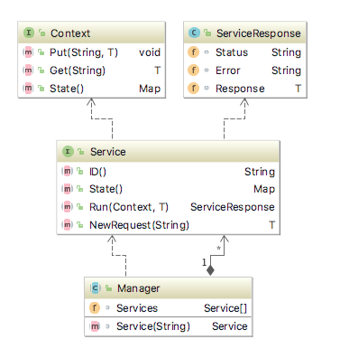

#Endly - Declarative end to end functional testing and automation framework.

[](https://goreportcard.com/report/github.com/viant/endly)
[](https://godoc.org/github.com/viant/endly)

This library is compatible with Go 1.8+

Please refer to [`CHANGELOG.md`](CHANGELOG.md) if you encounter breaking changes.

- [Motivation](#Motivation)
- [Installation](#Installation)
- [GettingStarted](#GettingStarted)
- [Introduction](#Introduction)
- [System services](#SystemServices)
- [Cloud and Network services](#CloudAndNetwork)
- [Build and deployment services](#Buildservices)
- [Testing services](#Testingservices)
- [Workfow Service](#Workfowservice)
- [Wrofklow execution control](#exectuincontrol)
- [Credentials](#credentail)
- [Usage](#Usage)
- [Best Practice](#BestPractice)
- [License](#License)
- [Credits and Acknowledgements](#Credits-and-Acknowledgements)


## Motivation

This library was developed to enable simple automated declarative end to end functional testing 
for web application developed in any language.

It addresses all aspect of testing automation namely:
- Local or remote system preparation including all services required by the application.
- Checking out the application code
- Building and deploying the application as a separate process, or in the container.
- Data preparation including RDBMS, or key/value store
- Test use cases with HTTP, REST or selenium runner.
- Verification of responses, data in datastores or log produced.
    

<a name="Installation"></a>
## Installation

```text
#optionally set GOPATH directory
export GOPATH=/Projects/go

go get -u github.com/viant/endly


```


<a name="GettingStarted"></a>
## Getting Started

[Download the latst endl](https://github.com/viant/endly/releases/)


To get you familiar with endly workflows, a few examples of fully functioning applications are included.
You can build, deploy and test them end to end all with endly.

 
1) **Web Service** 
   * [Reporter](example/ws/reporter) - a pivot table report builder.
        - Test with Rest Runner
        - Data Preparation and Validation (mysql)
2) **User Interface**
   * [SSO](example/ui/sso)  - user registration and login application.
        - Test with Selenium Runner
        - Data Preparation and Validation (aersopike)
        - Web Content validation
3) **Extract, Transform and Load (ETL)**
   * [Transformer](example/etl/transformer) - datastore to datastore transformer (i.e. aerospike to mysql)
       - Test with Rest Runner
       - Data Preparation and Validation (aersopike, mysql)
4) **Runtime**  - simple http request event logger
   * [Logger](example/rt/elogger)
       - Test with HTTP Runner
       - Log Validation
       
 

<a name="Introduction"></a>
## Introduction

Endly as a comprehensive testing framework automate the following step:

1) System preparation 
    1) System services initialization.  (RDBM, NoSQL, Caching 3rd Party API)
    2) Application container. (Application server, i,e, tomcat, glassfish)
2) Application build and deployment
    1) Application code checkout.
    2) Application build
    3) Application deployment
3) Testing
    1) Preparing test data
    2) Actual application testing
        1) Http runner
        2) Reset runner
        3) Selenium runner
    3) Application output verification
    4) Application persisted data verification
    5) Application produced log verification    
4) Cleanup
    1) Data cleanup 
    2) Application shutdown
    3) Application system services shutdown 
    


It uses tabular [Neatly](https://github.com/viant/neatly) format to represent a workflow, that
can be easily manged with either MS Excel, Apple Number or OpenOffice.


Neatly is responsible for converting a tabular document (.csv) into workflow object tree as shown below.


**[Workflow](workflow.go)** an abstraction to define a set of task with its action.

**Task** an abstraction to logically group one or more action, for example, init,test.

**Action** an abstraction defining a call to a service. 
An action does actual job, like starting service, building and deploying app etc, 

**ActionRequest** an abstraction representing a service request.
        
**ActionResponse** an abstraction representing a service response.

To execute action:
1) workflow service looks up a service by id, in workflow manager registry.
2) workflow service creates a new request for corresponding action on the selected service.
3) Action.Request  is first expanded with context.State ($variable substitution), to converted to service request.
4) Context with its state it is passed into every action so that it can be modified for state control, future data substitution. 
5) Service executes Run method for provided action to return ServiceResponse 


**[Service](service.go)** an abstraction providing set of functionalities triggered by specified action/request.

**State** key/value pair map that is used to mange state during the workflow run. 
The state can be change by providing variable definition.
The workflow content, data structures, can use dollar '$' sign followed by variable name 
to get its expanded to its corresponding state value if the key has been present.
 
The following diagram shows service with its component.



**[Variables](variable.go)** an abstraction having capabilities to change a state map.

A workflow variable defines data transition between input and output state map.


Variable has the following attributes
* **Name**: name can be defined as key to be stored in state map or expression 
     * array element push **->**, for instance ->collection, where collection is a key in the state map      
    * reference **$** for example $ref, where ref is the key in the state, in this case the value will be 

* **Value**: any type value that is used when from value is empty
* From  name of a key state key, or expression with key.    
The following expression are supported:
    * number increments  **++**, for example  counter++, where counter is a key in the state
    * array element shift  **<-**, for example  <-collection, where collection is a key in the state      
    * reference **$** for example $ref, where ref is the key in the state, in this case the value will be 
    evaluated as value stored in key pointed by content of ref variable
    

**Variable in actions:**


| Operation | Variable.Name | Variable.Value | Variable.From | Input State Before | Input State After | Out State Before | Out State  After |
| --- | --- | --- | ---- | --- | --- | --- | --- |
| Assignment | key1 | [1,2,3] | n/a | n/a | n/a | { } |{"key1":[1,2,3]}|
| Assignment by reference | $key1  | 1 | n/a| {"key1":"a"} | n/a | { } | {"a":1} |
| Assignment | key1 | n/a | params.k1 | {"params":{"k1":100}} | n/a | { } | {"key1":100} |
| Assignment by reference | key1  | n/a | $k | {"k":"a", "a":100} |n/a |  { } | {"key1":100} |
| Push | ->key1 | 1 | n/a | n/a | n/a | { } | {"key1":[1]} | 
| Push | ->key1 | 2 | n/a | n/a | n/a | {"key1":[1]} | {"key1":[1,2]} | 
| Shift | item | n/a  | <-key1 | n/a | n/a | {"key1":[1, 2]} | {"key1":[2], "item":1} | 
| Pre increment | key | n/a | ++i |  {"i":100} |  {"i":101}   | {} | {"key":101} } 
| Post increment | key | n/a | i++ | {"i":100} |  {"i":101}   | {} | {"key":100} } 


**Workflow Lifecycle**

1) New context with a new state map is created after inheriting values from a caller. (Caller will not see any state changes from downstream workflow)
2) **data** key is published to the state map with defined workflow.data. Workflow data field would stores complex nested data structure lika a setup data.
2) **params** key is published to state map with the caller parameters
3) Workflow initialization stage executes, applying variables defined in Workflow.Pre (input: workflow state, output: workflow state)
4) Tasks Execution 
    1) Task eligibility determination: 
        1) If specified tasks are '*' or empty, all task defined in the workflow will run sequentially, otherwise only specified
        2) Evaluate RunCriteria if specified
    2) Task initialization stage executes, applying variables defined in Task.Pre (input: workflow  state, output: workflow state)
    
    3) Executes all eligible actions:
        1) Action eligibility determination:
            1) Evaluate RunCriteria if specified
        2) Action initialization stage executes,  applying variables defined in Action.Pre (input: workflow  state, output: workflow  state)
        3) Executing action on specified service
        4) Action post stage executes applying variables defined in Action.Post (input: action.response, output: workflow state)
    4) Task post stage executes, applying variables defined in Task.Post (input: state, output: state)   
5) Workflow post stage executes, applying variables defined in Workflow.Post (input: workflow  state, output: workflow.response)
6) Context state comes with the following build-in/reserved keys:
    * rand - random int64
    * date -  current date formatted as yyyy-MM-dd
    * time - current time formatted as yyyy-MM-dd hh:mm:ss
    * ts - current timestamp formatted  as yyyyMMddhhmmSSS
    * timestamp.yesterday - timestamp in ms
    * timestamp.now - timestamp in ms
    * timestamp.tomorrow - timestamp in ms
    * tmpDir - temp directory
    * uuid.next - generate unique id
    * uuid.get - returns previously generated unique id, or generate new
    *.env.XXX where XXX is the Id of the env variable to return
    * previous - http previous request used for multi request send
    * 
    * all UFD registered functions  
        * [Neatly UDF](https://github.com/viant/neatly/#udf)
        * AsTableRecords udf converting []*DsUnitTableData into map[string][]map[string]interface{} (used by dsunit service)
	    

<a name="SystemServices"></a>
## System services

All services are running on the system referred as target and defined as [Resource](https://raw.githubusercontent.com/viant/toolbox/master/url/resource.go)

**Execution services**

The execution service is responsible for opening, managing terminal session, with ability to send command and extract data.

| Service Id | Action | Description | Request | Response |
| --- | --- | --- | --- | --- |
| exec | open | open SSH session on the target resource. | [OpenSessionRequest](service_exec_session.go#L9) | [OpenSessionResponse](service_exec_session.go#L19) |
| exec | close | closes SSH session | [CloseSessionRequest](service_exec_session.go#L24) | [CloseSessionResponse](service_exec_session.goL29) |
| exec | command | executes basic commands | [CommandRequest](service_exec_command.go#L40) | [CommandResponse](service_exec_command_response.go#L15) |
| exec | managed-command | executes commands with ability to extract data, define error or success state | [ExtractableCommandRequest](service_exec_command.go#L34) | [CommandResponse](service_exec_command_response.go#L15) |


**Daemon service.**

Daemon System service is responsible for managing system daemon services.

| Service Id | Action | Description | Request | Response |
| --- | --- | --- | --- | --- | 
| daemon | status | check status of system daemon | [DaemonStatusRequest](service_daemon_status.go) | [DaemonInfo](service_daemon_status.go) | 
| daemon | start | start requested system daemon | [DaemonStartRequest](service_daemon_start.go) | [DaemonInfo](service_daemon_status.go) | 
| daemon | stop | stops requested system daemon | [DaemonStopRequest](service_daemon_stop.go) | [DaemonInfo](service_daemon_status.go) | 


**Process service**

Process service is responsible for starting, stopping and checking status of custom application.

| Service Id | Action | Description | Request | Response |
| --- | --- | --- | --- | --- | 
| process | status | check status of an application | [ProcessStatusRequest](service_process_status.go) | [ProcessStatusResponse](service_process_status.go) | 
| process | start | start provided application | [ProcessStartRequest](service_process_start.go) | [ProcessStartResponse](service_process_start.go) | 
| process | stop | kill requested application | [ProcessStopRequest](service_process_stop.go) | [CommandResponse](exec_command_response.go) | 


**Docker service**

| Service Id | Action | Description | Request | Response |
| --- | --- | --- | --- | --- | 
| docker | run | run requested docker service | [DockerRunRequest](service_docker_run.go) | [DockerContainerInfo](service_docker_container.go#L54) | 
| docker | images | check docker image| [DockerImagesRequest](service_docker_image.go) | [DockerImagesResponse](service_docker_image.go) | 
| docker | stop-images | stop docker containers matching specified images | [DockerStopImagesRequest](service_docker_stop.go) | [DockerStopImagesResponse](service_docker_stop.go) |
| docker | pull | pull requested docker image| [DockerPullRequest](service_docker_pull.go) | [DockerImageInfo](service_docker_image.go) | 
| docker | process | check docker container processes | [DockerContainerCheckRequest](service_docker_container.go) | [DockerContainerCheckResponse](service_docker_container.go) | 
| docker | container-start | start specified docker container | [DockerContainerStartRequest](service_docker_container.go#L19) | [DockerContainerInfo](service_docker_container.go#L54) | 
| docker | container-command | run command within specified docker container | [DockerContainerRunCommandRequest](service_docker_container.go#L39) | [DockerContainerRunCommandResponse](service_docker_container.go#L49) | 
| docker | container-stop | stop specified docker container | [DockerContainerStopRequest](service_docker_container.go#L35) | [DockerContainerInfo](service_docker_container.go#L54) | 
| docker | container-remove | remove specified docker container | [DockerContainerRemoveRequest](service_docker_container.go#L23) | [DockerContainerRemoveResponse](service_docker_container.go#L28) | 
| docker | container-logs | fetch container logs (app stdout/stderr)| [DockerContainerLogsRequest](service_docker_container.go#L63) | [DockerContainerLogsResponse](service_docker_container.go#L69) | 
| docker | inspect | inspect supplied instance name| [DockerInspectRequest](service_docker_inspect.go) | [DockerInspectResponse](service_docker_inspect.go#L12) |
| docker | build | build docker image| [DockerBuildRequest](service_docker_build.go) | [DockerBuildResponse](service_docker_build.go) |
| docker | tag | create a target image that referes to source docker image| [DockerBuildRequest](service_docker_tag.go) | [DockerBuildResponse](service_docker_tag.go) |
| docker | login | store supplied credential for provided repository in local docker store| [DockerLoginRequest](service_docker_login.go) | [DockerLoginResponse](service_docker_login.go) |
| docker | logout | remove credential for supplied repository | [DockerLogoutRequest](service_docker_logout.go) | [DockerLogoutResponse](service_docker_logout.go) |
| docker | push | copy image to supplied repository| [DockerPushRequest](service_docker_push.go) | [DockerPushResponse](service_docker_push.go) |


**Storage service**

Storage service represents a local or remote storage to provide unified storage operations.
Remote storage could be any cloud storage i.e google cloud, amazon s3, or simple scp or http.
 

| Service Id | Action | Description | Request | Response |
| --- | --- | --- | --- | --- |
| storage | copy | copy one or more resources from the source to target destination | [StorgeCopyRequest](service_storage_copy.go) | [StorageCopyResponse](service_storage_copy.go) |
| storage | remove | removes or more resources if exsit | [StorageRemoveRequest](service_storage_remove.go) | [StorageRemoveResponse](service_storage_remove.go) |
| storage | upload | uploads content pointed by context state key to target destination. | [StorageUploadRequest](service_storage_copy.go) | [StorageUploadResponse](service_storage_upload.go) |
| storage | download | copy source content into context state key | [StorageDownloadRequest](service_storage_download.go) | [StorageDownloadResponse](service_storage_download.go) |


<a name="CloudAndNetwork"></a>

### Cloud services and Network services


**Amazon Elastic Compute Cloud Service**

Provides ability to call operations on  [EC2 client](https://github.com/aws/aws-sdk-go/tree/master/service/ec2)

| Service Id | Action | Description | Request | Response |
| --- | --- | --- | --- | --- |
| aws/ec2 | call | Run ec2 operation | [EC2CallRequest](service_ec2_call.go) | [EC2CallResponse](service_ec2_call.go)  |

'call' action's method and input are proxied to [EC2 client](https://github.com/aws/aws-sdk-go/tree/master/service/ec2)


**Google Compute Engine Service**

Provides ability to call operations on  [*compute.Service client](https://cloud.google.com/compute/docs/reference/latest/)

| Service Id | Action | Description | Request | Response |
| --- | --- | --- | --- | --- |
| gce | call | Run gce operation | [GCECallRequest](service_gce_call.go) | [GCECallResponse](service_gce_call.go)  |

'call' action's service, method and paramters are proxied to [GCE client](https://cloud.google.com/compute/docs/reference/latest/)


**Network service**

Network service is responsible opening tunnel vi SSH between client and target host.

| Service Id | Action | Description | Request | Response |
| --- | --- | --- | --- | --- | 
| network | tunnel | Tunnel ports between local and remote host | [NetworkTunnelRequest](service_network_tunnel.go) | [NetworkTunnelResponse](service_network_tunnel.go) | 


**Http Endpoint Service**

Http Endpoint Service is responsible for creating HTTP endpoint serving previously recorded HTTP conversation.


| Service Id | Action | Description | Request | Response |
| --- | --- | --- | --- | --- | 
| http/endpoint | listen | Starts HTTP endpoint with supplied HTTP trips recording | [HTTPEndpointListenRequest](service_http_ednpoint_listen.go) | [HTTPEndpointListenResponse](service_http_ednpoint_listen.go) | 


**SMTP Service**

SMTP service is responsible for sending emails.
Mail body is being substitute with the context state variables.

| Service Id | Action | Description | Request | Response |
| --- | --- | --- | --- | --- | 
| smtp | send | Send an email to supplied recipients | [SMTPSendRequest](service_smtp_send.go#L10) | [SMTPSendResponse](service_smtp_send.go#L17) | 


<a name="Buildservices"></a>
## Build and deployment services


**Sdk Service**

Sdk service sets active terminal session with requested sdk version.

| Service Id | Action | Description | Request | Response |
| --- | --- | --- | --- | --- | 
| sdk | set | sets system with requested sdk and version | [SdkSetRequest](service_sdk_set.go) | [SdkSetResponse](service_sdk_set.go) | 


**Version Control Service**

| Service Id | Action | Description | Request | Response |
| --- | --- | --- | --- | --- |
| version/control | status | Runs version control check on provided URL | [VcStatusRequest](service_vc_status.go) | [VcInfo](service_vc_info.go)  |
| version/control | checkout | If target directory already  exist with matching origin URL, this action only pulls the latest changes without overriding local ones, otherwise full checkout | [VcCheckoutRequest](service_vc_checkout.go) | [VcInfo](service_vc_info.go)   |
| version/control | commit | commit commits local changes to the version control | [VcCommitRequest](service_vc_commit.go) | [VcInfo](service_vc_info.go)   |
| version/control | pull | retrieves the latest changes from the origin | [VcPullRequest](service_vc_pull.go) | [VcInfo](service_vc_info.go)   |


**Build service**

| Service Id | Action | Description | Request | Response |
| --- | --- | --- | --- | --- |
| build | load | Loads meta build instruction | [BuildLoadMetaRequest](service_build_load.go) | [BuildLoadMetaResponse](service_build_load.go)  |
| build | build | Run build for provided specification | [BuildRequest](service_build_build.go) | [BuildResponse](service_build_build.go)  |


**Deployment service** 
Deployment service check if target path resource, the app has been installed with requested version, if not it will transfer it and run all defined commands/transfers.
Maven, tomcat use this service.

| Service Id | Action | Description | Request | Response |
| --- | --- | --- | --- | --- |
| deployment | load | Loads meta deployment instruction | [DeploymentLoadMetaRequest](service_deployment_load.go) | [DeploymentLoadMetaResponse](service_deployment_load.go) |
| deployment | deploy | run deployment | [DeploymentDeployRequest](service_deployment_deploy.go) | [DeploymentDeployResponse](service_deployment_deploy.go) |


<a name="Testingservices"></a>
### Testing services

**Http Runner** 

Http runner sends one or more http request to the specified endpoint, it manages cookie with one grouping send request.


| Service Id | Action | Description | Request | Response |
| --- | --- | --- | --- | --- |
| http/runner | send | Sends one or more http request to the specified endpoint. | [SendHttpRequest](service_http_runner_send.go) | [SendHttpResponse](service_http_runner_send.go) |


**Rest Runner**

| Service Id | Action | Description | Request | Response |
| --- | --- | --- | --- | --- |
| rest/runner | send | Sends one rest request to the endpoint. | [RestSendRequest](service_rest_send.go) | [RestSendResponse](service_rest_send.go) |


**Selenium Runner** 

Selenium runner open a web session to run various action on web driver or web elements.

| Service Id | Action | Description | Request | Response |
| --- | --- | --- | --- | --- |
| selenium | start | Starts standalone selenium server | [SeleniumServerStartRequest](service_selenium_start.go) | [SeleniumServerStartResponse](service_selenium_start.go) |
| selenium | stop | Stops standalone selenium server | [SeleniumServerStopRequest](service_selenium_start.go) | [SeleniumServerStopResponse](service_selenium_stop.go) |
| selenium | open | Open a new browser with session id for further testing | [SeleniumOpenSessionRequest](service_selenium_session.go) | [SeleniumOpenSessionResponse](service_selenium_session.go) |
| selenium | close | Close browser session | [SeleniumCloseSessionRequest](service_selenium_session.go) | [SeleniumCloseSessionResponse](service_selenium_session.go) |
| selenium | call-driver | Call a method on web driver, i.e wb.GET(url)| [SeleniumWebDriverCallRequest](service_selenium_call_web_driver.go) | [SeleniumServiceCallResponse](service_selenium_call_web_driver.go) |
| selenium | call-element | Call a method on a web element, i.e. we.Click() | [SeleniumWebElementCallRequest](service_selenium_call_web_element.go) | [SeleniumWebElementCallResponse](service_selenium_call_web_element.go) |
| selenium | run | Run set of action on a page | [SeleniumRunRequest](service_selenium_run.go) | [SeleniumRunResponse](service_selenium_run.go) |

call-driver and call-element actions's method and parameters are proxied to stand along selenium server via [selenium client](http://github.com/tebeka/selenium)

**Generic validation service**

| Service Id | Action | Description | Request | Response |
| --- | --- | --- | --- | --- |
| validator | assert | performs validation on provided actual  vs expected data structure. | [ValidatorAssertRequest](service_validator_assert.go) | [AssertionInfo](assertion_info.go) |


**Log validation service** 

In order to get log validation, 
   1) register log listener, to dynamically detect any log changes (log shrinking/rollovers is supported), as long as new logs is detected it is ready to be validated.
   2) run log validation. Log validation removes validated logs from the pending queue.
   3) optionally reset listener to discard pending validation logs.


| Service Id | Action | Description | Request | Response |
| --- | --- | --- | --- | --- |
| validator/log | listen | starts listening for log file changes on specified location  |  [LogValidatorListenRequest](service_log_validator_listen.go) | [LogValidatorListenResponse](service_log_validator_listen.go)  |
| validator/log | reset | discards logs detected by listener | [LogValidatorResetRequest](service_log_validator_reset.go) | [LogValidatorResetResponse](service_log_validator_reset.go)  |
| validator/log | assert | performs validation on provided expected log records against actual log file records. | [LogValidatorAssertRequest](service_log_validator_assert.go) | [LogValidatorAssertResponse](service_log_validator_assert.go)  |


** Validation expressions **
Generic validation service and log validator, Task or Action RunCritera share undelying validator, 
During assertion validator traverses expected data structure to compare it with expected.
If expected keys have not been specified but exists in actual data structure they are being skipped from assertion.


| Equal |  actual | expected |
| --- | --- | --- |
| Not Equal |  actual | !expected |
| Contains | actual | /expected/|
| Not Contains | actual | /!expected/|
| RegExpr | actual | ~/expected/ |
| Not RegExpr | actual | ~/!expected/ |
| Between | actual | /[minExpected..maxExpected]/ |
| exists | n/a | { "key": "@exists@" }


**Array of object vs expected map assertion transformation:**

It is possible to convert actual array of object to map, 
with "@indexBy@ directive.

Take as example the following actual and expected data structure.

\#actual
```json
[
{"id":1, "name":"name1"},
{"id":2, "name":"name2"}
]

```

\#expected
```json
{
"@indexBy@":"id",
"1" :{"id":1, "name":"name1"},
"2" :{"id":2, "name":"name2"}
}

```
	

TODO: unify endly and dsunit validation with macro expression. 

**Datastore services**

The first action that needs to be run is to register database name with dsc connection config, and optionally init scripts.


| Service Id | Action | Description | Request | Response |
| --- | --- | --- | --- | --- |
| dsunit | register | register database connection, and optionally executes init scripts |  [DsUnitRegisterRequest](service_dsunit_register.go) | [DsUnitRegisterResponse](service_dsunit_register.go)  |
| dsunit | mapping |  register virtual mapping between a virtual table and dozen actual tables to simplify setup. |  [DsUnitMappingRequest](service_dsunit_mapping.go) | [DsUnitMappingResponse](service_dsunit_mapping.go)  |
| dsunit | sequence | takes current sequences for specified tables |  [DsUnitTableSequenceRequest](service_dsunit_sequence.go) | [DsUnitTableSequenceResponse](service_dsunit_sequence.go)  |
| dsunit | sql | executes SQL from supplied URL, or inline SQL |  [DsUnitSQLRequest](service_dsunit_sql.go) | [DsUnitSQLResponse](service_dsunit_sql.go)  |
| dsunit | prepare | populates database with setup data |  [DsUnitTablePrepareRequest](service_dsunit_prepare.go) | [DsUnitTablePrepareResponse](service_dsunit_prepare.go)  |
| dsunit | expect | verifies database content with expected data |  [DsUnitTableExpectRequest](service_dsunit_prepare.go) | [ValidationInfo](validation_info.go)  |

To simplify setup/verification data process [DsUnitTableData](service_dsunit_data.go) has been introduce, so that data can be push into state, and then transform to the dsunit expected data with AsTableRecords udf function.


DsUnit uses its own predicate and macro system to perform advanced validation see [Macros And Predicates](../dsunit/docs/)


<a name="Workfowservice"></a>
## Workflow service

**Workflow Service**

Workflow service provide capability to run task, action from any defined workflow.

| Service Id | Action | Description | Request | Response |
| --- | --- | --- | --- | --- |
| workflow | load | Loads workflow from provided path | [WorkflowLoadRequest](service_workflow_load.go) | [WorkflowLoadRequest](service_workflow_load.go)  |
| workflow | register | Register provide workflow in registry | [WorkflowLoadRequest](service_workflow_register.go) |  |
| workflow | run | run workflow with specified tasks and parameters | [WorkflowRunRequest](service_workflow_run.go) | [WorkflowRunResponse]((service_workflow_run.go) |
| workflow | goto | switches current execution to the specified task on current workflow | [WorkflowGotoRequest](service_workflow_goto.go) | [WorkflowGotoResponse]((service_workflow_goto.go) 
| workflow | switch | Runs matched  case action or task  | [WorkflowSwitchRequest](service_workflow_switch.go) | [WorkflowSwitchResponse](service_workflow_switch.go) |
| workflow | exit | terminates execution of active workflow (caller) | n/a | n/a |


<a name="predefined_workflows">	
**Predefined workflows**
</a>

| Name | Task |Description | 
| --- | --- | --- |
| dokerized_mysql| start | start mysql docker container  |
| dokerized_mysql| stop | stop mysql docker container 
| dockerized_aerospike| start | aerospike mysql docker container |
| dockerized_aerospike| stop | stop aerospike docker container |
| dockerized_memcached| start | aerospike memcached docker container |
| dockerized_memcached| stop | stop memcached docker container |
| tomcat| install | install tomcat |
| tomcat| start | start tomcat instance|
| tomcat| stop | stop tomcat instance |
| vc_maven_build | checkout | checkout the latest code from version control |
| vc_maven_build | build | build the checked out code |
| vc_maven_module_build | checkout | check out all required projects to build a module |
| vc_maven_module_build | build | build module |
| ec2 | start | start ec2 instance |
| ec2 | stop | stop  ec2 instance |
| gce | start | start gce instance |
| gce | stop | stop  gce instance |
| notify_error | notify | send error |
 
 
 
 <a name="predefined_requests">
 **Predefined workflow run requests**
 </a>
 
 
 | Name | Workflow | 
 | --- | --- | 
 | [tomcat.json](req/tomcat.json) | tomcat | 
 | [aerospike.json](req/aerospike.json)| dockerized_aerospike |
 | [mysql.json](req/mysql.json)| dockerized_mysql |
 | [memcached.json](req/memcached.json)| dockerized_memcached|
 | [ec2.json](req/ec2.json)| ec2 |
 | [gce.json](req/gce.json)| gce |
 | [notify_erro.json](req/notify_error.json)| notify_error |
 
 
 Notify error can be use in conjunction with Workflow.OnTaskError, see below workflow snippet
 
 | Workflow | Name | Tasks | OnErrorTask | | | |
 |---|---|---|---|---|---|---|
 |---|test|%Tasks|onError  | |  | |
 |[]Tasks|Name|Description|Actions| | | |
 | | onError|On error task|%OnError| | | |
 |[]OnError|Description|Service|Action|Request|error|[]receivers|
 | |send error notification | workflow | run | #req/notify_error | $error |	abc@somewehre.com |


<a name="exectuincontrol"></a>

## Workflow execution control:

By default workflow run all specified task, where each task once started executes sequentially all it actions, unless they flag as Asyn execution.

Each action has ability to control its execution with

**Action level criteria control**

Each action has the following fields to control conditional execution:

1. RunCriteria: criteria that check is action is eligible to run
2. SkipCriteria: in case actions are grouped by TagID, skip criteria will skip remaining action in the current group to continue in the next group.
3. Repeatable control
    
```go
    type Repeatable struct {
    	Extraction   DataExtractions //textual regexp based data extraction
    	Variables    Variables       //structure data based data extraction
    	Repeat       int             //how many time send this request
    	SleepTimeMs  int             //Sleep time after request send, this only makes sense with repeat option
    	ExitCriteria string          //Repeat exit criteria, it uses extracted variable to determine repeat termination 
    }
````
    
        
**Workflow goto task action**
Workflow goto action terminates current task actions execution to start specified current workflow task.`

**Workflow switch action** 
Workflow switch action enable to branch execution based on specified context.state key value. 
Note that switch does not terminates next actions within current task.

**Error handling**
If there is an error during workflow execution, it failes immediately unless OnErrorTask is defined to catch and handle error.
In addition error key is placed into the config with the following content:

```go
type WorkflowError struct {
	Error        string
	WorkflowName string
	TaskName     string
	*ActionRequest
	Request      interface{}
	Response     interface{}
}
```


**Finally** 
Workflow also offer DeferTask to execute as the last workflow step in case there is an error or not for instance to clean up resource.

 
     
<a name="credentail"></a>

## Credentials
     
Endly on its core uses SSH or other system/cloud service requiring credentials. 
In order to run system workflow the credentials file/s need to be supplied as various request field.


Endly uses  [Credentail Config](https://github.com/viant/toolbox/blob/master/cred/config.go) 
  * it can store user and blowfish encrypted password generated by ['secret' app](endly/secret.go) , which can be [downloaded](https://github.com/viant/endly/releases/)
    * it can store google cloud compatible secret.json fields
  * it can store AWS cloud compatible fields.


Endly service were design in a way to  hide user secrets, for example whetever sudo access is needed,
endly will output **sudo** in the execution event log and screen rather actual password.
     
     
     
     
<a name="Usage"></a>

## Usage

In most case scenario you would use **endly** app supplied with [release binary for your platform](https://github.com/viant/endly/releases/).
Alternatively you can build latest version of endly with the following command:

```bash

export GOPATH=~/go
go get -u github.com/viant/endly
go get -u github.com/viant/endly/endly

```

endly will be build in the $GOPATH/bin


Make sure its location is on your PATH 


```text

$ endly -h


endly 0.1.0
Usage of endly:
endly [options] [params...]
	params should be key value pair to be supplied as actual workflow parameters
	if -r options is used, original request params may be overriden

where options include:
  -d	enable logging
  -h	print help
  -l string
    	<log directory> (default "logs")
  -p	print neatly workflow as JSON
  -r string
    	<path/url to workflow run request in JSON format>  (default "run.json")
  -t string
    	<task/s to run> (default "*")
  -v	print version (default true)
  -w string
    	<workflow name>  if both -r and -w valid options are specified, -w is ignored (default "manager")
    	

```


When specified workflow or request it can be name of endly [predefined workflow](#predefined_workflows) 
or [request](#predefined_requests).

For instance the following command will print ec2 workflow in JSON format.

```bash

endly -p -w ec2

```


The following command will run predefined ec2 workflow with -w option

```bash

endly -w ec2 -t start awsCredential ~/.secret/aws.json ec2InstanceId i-0ef8d9260eaf47fdd

```


Example of WorkflowRunRequest JSON

```json
{
  "WorkflowURL": "manager.csv",
  "Name": "manager",
  "PublishParameters":false,
  "EnableLogging":true,
  "LoggingDirectory":"/tmp/myapp/",
  "Tasks":"init,test",
  "Params": {
    "jdkVersion":"1.7",
    "buildGoal": "install",
    "baseSvnUrl":"https://mysvn.com/trunk/ci",
    "buildRoot":"/build",
    "targetHost": "127.0.0.1",
    "targetHostCredential": "${env.HOME}/secret/scp.json",
    "svnCredential": "${env.HOME}/secret/adelphic_svn.json",
    "configURLCredential":"${env.HOME}/secret/scp.json",
    "mysqlCredential": "${env.HOME}/secret/mysql.json",
    "catalinaOpts": "-Xms512m -Xmx1g -XX:MaxPermSize=256m",

    "appRootDirectory":"/use/local",
    "tomcatVersion":"7.0.82",
    "appHost":"127.0.0.1:9880",
    "tomcatForceDeploy":true
  },

  "Filter": {
    "SQLScript":true,
    "PopulateDatastore":true,
    "Sequence": true,
    "RegisterDatastore":true,
    "DataMapping":true,
    "FirstUseCaseFailureOnly":false,
    "OnFailureFilter": {
      "UseCase":true,
      "HttpTrip":true,
      "Assert":true
    }

  }
}

```


See for more filter option: [RunnerReportingFilter](runner_filter.go).


In case you have defined you one UDF or have other dependencies you have to build endly binary yourself.
The following template can be used to run a workflow from a command line 


\#endly.go
```go

package main

//import you udf package  or other dependencies here

import "github.com/viant/endly/bootstrap"

func main() {
	bootstrap.Bootstrap()
}


```       
         
         
         
<a name="BestPractice"></a>
## Best Practice

1) Delegate a new workflow request to dedicated req/ folder
2) Variables in  Init, Post should only define state not requests
3) Flag variable as Required or provide a fallback Value
4) Use [Tag Iterators](https://github.com/viant/neatly#tagiterator) to group similar class of the tests 
5) Since JSON inside tabular cell is not too elegant try to use [Virtual object](https://github.com/viant/neatly#vobject) instead.
6) Organize  workflows and data by  grouping system, datastore, test functionality together. 


Here is an example directory layout.

```text

    manager.csv
        |- system / 
        |      | - system.csv
        |      | - init.json (workflow init variables)
        |      | - req/         
        | - regression /
        |       | - regression.csv
        |       | - init.json (workflow init variables)
        |       | - <use_case_group1> / 1 ... 00X (Tag Iterator)/ <test assets>
        |       | 
        |       | - <use_case_groupN> / 1 ... 00Y (Tag Iterator)/ <test assets>
        | - config /
        |       
        | -  <your app name for related workflow> / //with build, deploy, init, start and stop tasks 
                | <app>.csv
                | init.json 
        
        | - datastore /
                 | - datastore.csv
                 | - init.json
                 | - dictionary /
                 | - schema.ddl
    
```
  
  

Finally contribute by creating a  pull request with a new common workflow so that other can use them.


## GoCover

[](https://gocover.io/github.com/viant/endly)


         	
<a name="License"></a>
## License

The source code is made available under the terms of the Apache License, Version 2, as stated in the file `LICENSE`.

Individual files may be made available under their own specific license,
all compatible with Apache License, Version 2. Please see individual files for details.


<a name="Credits-and-Acknowledgements"></a>

##  Credits and Acknowledgements

**Library Author:** Adrian Witas

