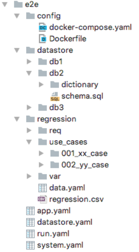

## Test project generator 

Test project generator has ability to create initial test project with various setup, data and testing options.


##Usage

#### Generate test project


```bash
endly -g
```

or via [online test generator](https://endly-external.appspot.com/)


 1. In Template dropdown select external application URL template
 2. In Origin type your application URL i.e. file:///Project/myapp or http://github.com/repo/myapp
    - if application codebase defines Dockerfile and docker-compose.yaml endly includes them in the app.yaml workflow. 
 3. Select SDK
 4. Select application databases
 5. Select testing options 

A initial test project workflows:



  -  run.yaml is an entry point orchestrating other workflows.
  -  system.yaml deploys application services
  -  datastore.yaml creates databases schema and loads static data.
  -  app.yaml builds and deploy application
  -  regression/regression.csv sets use cases initial state and runs tests.
  -  data.yaml registers data stores and sets initial data state  


#### Running all tasks

```bash
endly 
```

#### System, data store initialization and application build and deployment.

```bash
endly -t=init
```

#### Running only all tests

```bash
endly -t=test
```

#### Running individual test

endly -t=test -i=<tagID>

#### Running individual test with debug logs

endly -t=test -d=true -i=<tagID>  
