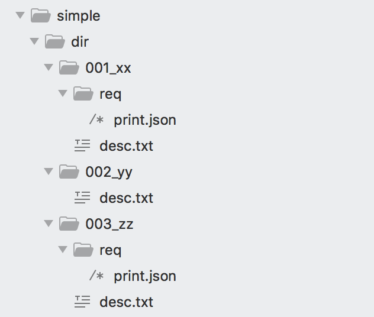
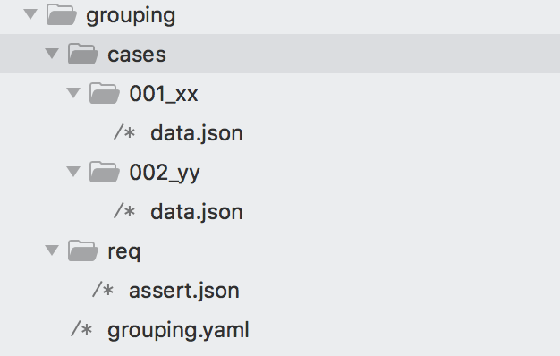
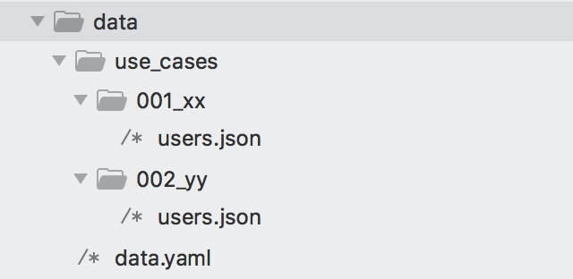
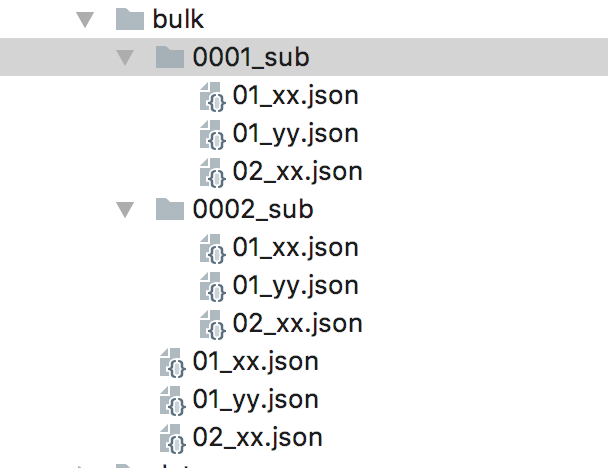

## Inline Workflow

- [Introduction](#introduction)
- [Inline Workflow format](#format)
- [Action invocation](#action)
- [Workflow invocation](#workflow)
- [State modification](#state)
- [Workflow control](#control)
- [Actions template](#template)


<a name="introduction"></a>
### Introduction

Endly uses [Inline Workflow](../../model/inline_workflow.go) to define a sequential tasks with yaml files.
For instance the following workflow runs SSH command (service: exec, action: run).


```bash
endly -r=run
```

@run.yaml
```yaml
pipeline:
  action: exec:run
  target:
    url:  ssh://127.0.0.1/
    credentials: ${env.HOME}/.secret/localhost.json
  commands:
    - mkdir -p /tmp/app/build 
    - chown ${os.user} /tmp/app/build 
```


<a name="format"></a>
### Inline Workflow format

The general inline workflow syntax: 

@xxx.yaml
```yaml
params:
  k1:v1
init: var/@init
defaults:
  d1:v1

pipeline:
  task1:
     action: serviceID:action
     requestField1: val1
     requestFieldN: valN
           
  taskN:
    subTaskA:
      workflow: workflowSelector
      tasks: task selector
      paramsKey1: val1
      paramKeyN: valN
      
    subTaskX:
       action: serviceID:someAction
       requestField1: val1
       requestFieldN: valN
       '@init':
         - i = 0 
       ':init': true
     subTaskY:
        action: serviceID:someAction
        request: @action_request1 
    subTaskY:
        action: serviceID:someAction
        request: @request2 @data  


post: 
  - age = $response.user.age
```

- _params_ node defines command line arguments
- _init_ node defines initial workflow variables/state
- _executable node_ a node defining action or workflow attributes.
- _defaults_ node defines attributes that will be merge with every executable node.
- _pipeline_ node defines set of tasks with its actions, which are be executed sequentially.
- _post_ node defines post execution current workflow state data extraction to workflow run response


Inline workflow translates input yaml file into target [workflow](./../../model/workflow.go).
To see the [*model.Workflow tree](../../model/workflow.go) translated from a inline workflow run the following

```bash
endly -r=PIPELINE_FILE.yaml -p  -f=yaml|json
```


Presence of 'action' or 'workflow' attributes in a node makes the node executable, which means endly will invoke specified service with corresponding action and defined action request.
Since the executable node share the namespace for both [action.go](./../../model/action.go) attributes and action request attributes,
you can use key prefix to instruct how data is dispatched. For instance '@init' defines an action init variable section, while
 ':init' defines action request init attribute, if prefix is not used key is dispatched for both action and action request attributes.

Additionally action request can be delegated to external file with 'request' key, file has to start with '@' to reference external resource. 

##### Multi resource loading

Delegating request to external resource supports multi asset loading, which means that any structured data from subsequent asset 
can be used to expand the main request asset. For instance: '@request.json @payload.json' expression expands request: $payload1 and $payload2 keys from @payload asset.

where
@request.json
```json
{
"requests":[
    {
        "method":"post",
        "URL":"someURL",
        "Body":"$payload1"
    },
    {
        "method":"post",
        "URL":"someURL",
        "Body":"$payload2"
    },
    {
        "method":"post",
        "URL":"someURL",
        "Body":"$payload1"
    }
  ]
}

``` 
@payload.json
```json
{
  "payload1":"some payload 1",
  "payload2":"some payload 2"
}
```

The executable node ancestor represent one or mode grouping tasks, that run sequentially or can be filtered with endly -t=task1,taskN option. -t='*' means run all tasks.

By default each executable node is also converted to a task with only one action, so that endly -t=taskname allows you to select one or more nodes to run at a time.
In some case for instance in parallel actions execution which is implemented within a task,  you want to group action under one task node. 
In order to group actions under parent task set multiAction: true

```yaml
pipeline:
  task1:
    multiAction: true
    action1:
      action: print
      message: hello from action 1
      sleepTimeMs: 3000
      async: true
    action2:
      action: print
      message: hello from action 2
      sleepTimeMs: 3000
      async: true
    action3:
      action: print
      message: hello from action 3
      sleepTimeMs: 3000
```


<a name="action"></a>
### Action invocation

The generic service action invocation syntax:

```yaml
pipeline:
  task1:
    action: [SERVICE.]ACTION
    param1: val1
    paramX: valX
```

If SERVICE is omitted, 'workflow' service is used.

Run the following to check available endly services

```bash
endly -s='*'
```

Run the following to check available services actions

```bash
endly -s='SERVICE_ID' -a
```

Run the following to check available services action contract (request/response)

```bash
endly -s='SERVICE_ID' -a='ACTION'
```


<a name="workflow"></a>
### Sub workflow invocation

The generic external workflow invocation syntax:

```yaml
pipeline:
  task1:
     workflow: WORKFLOW_NAME[:TASKS_TO_RUN]
     param1: val1
     paramX: valX
```

for example the following workflow task1: invokes predefined [assert workflow](../../shared/workflow/assert/assert.csv) with task:'assert' 

```bash
endly -r=test
```

@test.yaml    
 ```yaml
 pipeline:
   task1:
      workflow: assert:assert
      expected: 10
      actual: 1
 ```


<a name="state"></a>
### State modification

#### Default values

In case a tasks share data defaults value can be used to apply the same values accross tasks

For example to avoid message attribute duplication in task1 and task2  

@test.yaml
 ```yaml
pipeline:
  task1:
    action: print
    message: hello world
    color: red
  task2:
    action: print
    message: hello world
    color: blue
```

you can use the following:

@test.yaml
 ```yaml
defaults:
  message: hello world
pipeline:
  task1:
    action: print
    color: red
  task2:
    action: print
    color: blue
```

#### State modification


State initialization can be applied on top(workflow) or task/action node level. 
Parameters can be passed from command line.


@run.yaml
 ```yaml
init: 
  var1: $params.msg
  var2: 
    k1: 1
    k2: 2
pipeline:
  task1:
    init:
      var3:
        - 1
        - 2
        
    action: print
    message: $var1 $var2 $var3
```

```bash
endly -r=run msg=hello
```


**Using udf**:

The following pipeline provide example of using WorkingDirectory and FormatTime [UDFs](../udf).

@run.yaml
 ```yaml
init:
  appPath: $WorkingDirectory(../)
  bqTimeFormatArgs:
    - now
    - yyyy-MM-dd HH:mm:ss.SSSZ
  bqTimestamp: $FormatTime($bqTimeFormatArgs)

pipeline:
  run:
    action: print
    message: upper: $appPath <-> ts: $bqTimestamp
```


```bash
endly -r=run
```

Post processing state modification.

If action or workflow returns a data then post defines a way to publish result data to context.state, 
result data can also be access with task/action name.
 
@test.yaml
 ```yaml
pipeline:
  task1:
    init:
      - var1 =  $params.p1 
    action: exec:run
    target:
      URL: ssh://127.0.0.1
      credentials: localhost
    commands:
      - ls -al /tmp/
      
    post:
      stdout: $Output
  task2:
    action: print
    message: $stdout        
  task3:
    action: print
    message: $task1.Output        
```


<a name="control"></a>
## Workflow control:


**Conditional execution**
_'When'_ attribute instruct to run an action ony if criteria is met.


```bash
endly -r=check p=a1
```

@check.yaml
```yaml
pipeline:
  task1:
    action1:
      when: $p = a1
      action: print
      message: hello from action 1
    action2:
      when: $p = a2
      action: print
      message: hello from action 2
```


**Parallel execution:**


```bash
endly -r=parallel
```

@parallel.yaml
```yaml
pipeline:
  task1:
    multiAction: true
    action1:
      action: print
      message: hello from action 1
      sleepTimeMs: 3000
      async: true
    action2:
      action: print
      message: hello from action 2
      sleepTimeMs: 3000
    action3:
      action: print
      message: hello from action 3
      sleepTimeMs: 3000
      async: true
```


**Error handling**


By default an error terminates workflow execution, i
if 'catch' node is defined it can handle error so that workflow execution can continue 


```bash
endly -r=catch var1=failNow

endly -r=catch var1=ignore
```

@catch.yaml
```yaml
pipeline:
  task1:
    action1:
      action: print
      message: hello action 1
    action2:
      when: $var1 = failNow
      action: fail
      message: execption in action 2

    action2:
      action: print
      message: hello action 3

  task2:
    action1:
      action: print
      message: hello task 2 action 1

  catch:
    action: print
    message: caught $error.Error

```


**Defer Node**

Defer node if defined always runs at the last step

```bash
endly -r=defer
```

@defer.yaml
```yaml
pipeline:
  task1:
    action1:
      action: print
      message: hello action 1
    action2:
      action: fail
      message: execption in action 2

    action2:
      action: print
      message: hello action 3
  defer:
    action: print
    message: allway run

```

**Switch Case**

```bash
endly -r=switch_case var1=1
```

@switch_case.yaml
```yaml
pipeline:
  controller:
     action: switch
     sourceKey: var1
     default:
       task: task3
     cases:
        - value: 1
          task: task1
        - value: 2
          task: task2

  task1:
    multiAction: true
    action1:
      action: print
      message: selected task1
    exit:
      action: exit

  task2:
    multiAction: true
    action1:
      action: print
      message: selected task2
    exit:
      action: exit

  task3:
    multiAction: true
    action1:
      action: print
      message: selected default
    exit:
      action: exit
```

**Loop Execution**

```go
endly -r=loop
```


@loop.yaml
```yaml
init:
  - i = 0
pipeline:
  loop:
    multiAction: true
    show-counter:
      action: print
      message: counter $i
    increment:
      action: nop
      init:
        - i = $i++
    goto:
      when: $i < 10
      action: goto
      task: loop
```

<a name="template"></a>
## Actions template

In some cases (i.e. regression workflow) where there is a generic flow with data organized in sub directories
the inline action template comes handy. 
When actions template is used, endly repeats the template node N times defined by range max - min, 
tagging each repeated instance with unique TagId identifier. 


In order to control behaviour of repeated actions the following variables can be used:
- $index - sequential number generated for each template repetition
- $tagId - unique tag ID generated shared for the same $index, $subpath and group.
- $path - dynamically expanded full path matching subPath expression
- $subPath - dynamically expanded relative to workflow location path matching subPath expression


[@simple.yaml](simple/simple.yaml)
```yaml
pipeline:
  init:
    action: print
    message: init ...

  test:
    tag: Test
    range: 1..003
    description: '@desc'
    subPath: dir/${index}_*
    template:

      action1:
        action: print
        message: action 1 - message from $index $tagId $subPath

      action2:
        when: $HasResource(${path}/req/print.json)
        action: print
        request: '@req/print'

    post-test:
      action: print
      message: post test


  destroy:
    action: print
    message: destroy...
```

Assume that a [simple](simple) folder has the following structure
[](simple)


```bash
endly -r=simple
```

_Relative external request_ path

In the above example in the action2, a request is loaded from external using relative path,
when relative path is used endly first look into tag dynamically expanded path, 
in case when resource is not found it uses workflow path as fallback.

Note that @ is used for referencing external resource, if file has .json, .yaml .txt extension you can skip it.


_Providing tag description_

When endly runs a task with various tagIDs, each time tagID changes it has ability to print TagDescription.
To provide a tag description specify description value in the template owner node with corresponding file name, 
Make sure that the file is located in each sub directory.
Note that @ is used for referencing external resource, if file has .json, .yaml, .txt extension you can skip it.


_Running only selected TagIDs_

By default all actions in template section are flatten to template owner node task (i.e test)
Thus endly -t=taskName switch can not be applied to any template node.
Instead endly provides a support to run only matched tagIDs with endly -i switch

i.e 

```bash
 endly -r=simple.yaml  -i=simple_Test_dir001_xx
```


**Grouping actions**

To provide more fine grain control over expanded tagged actions you can also group them with additional parent grouping node, 
and use skip criteria to move to next group if necessary.

[@grouping/grouping.yaml](grouping/grouping.yaml)


```yaml
pipeline:
  test:
    range: 1..002
    subPath: cases/${index}_*
    template:
      group1:
        validate:
          action: validator:assert
          request: '@req/assert @data'
        info:
          action: print
          message: "$index: group 1; failed: $validate.FailedCount, passed: $validate.PassedCount"
        optional:
          skip: $validate.FailedCount > 0
          action: print
          message: "$index: group 1; optional action"
      group2:
        other:
          action: print
          message: "$index: group 2; action 4"


```

Assume that a [grouping](grouping) folder has the following structure
[](grouping)


```bash
endly -r=grouping 
```


**Loading workflow data**

In some case where tagID level data needs to be available for processing before actual tagID executes, 
for instance for bulk insert into database you can define a **'data'** attribute on the template owner task node.
A key of the data map defines target in the defining workflow.Data structure.
Value of that map defines a file name that will be loaded into workflow.Data  target if present, 
in case the file is not defined in tagId subPath you can fallback to a default file loading from workflow location.

Using [] instruct endly to push loaded data to a slice. 


[@data/data.yaml](data/data.yaml)

```yaml
pipeline:
  test:
    tag: Test
    data:
      'someKey.[]users': '@users'
    range: 1..002
    subPath: use_cases/${index}_*
    template:
      action1:
        action: print
        init:
          - name: user
            from: <-data.someKey.users
        message: action 1 $index $user.email

```

```bash
endly -r=data
```

Assume that a [data](data) folder has the following structure:
[](data)


[See moee ...](./../../testing/dsunit/README.md#loaddata) to how to load data to database/datastore with dsunit service

**Bulk data loading**

```bash
endly -r=bulk
```

[@bulk.yaml](bulk.yaml)
```yaml
pipeline:
  test1:
    tag: Test1
    data:
      '[]xx': '@bulk/*_xx'
    range: 1..1
    template:
      action1:
        action: print
        init:
          xx: $data.xx
        message: 'xx: $xx'

  test2:
      tag: Test2
      subPath: bulk/sub_${index}
      data:
        '$tagId.[]x': '@*_xx'
      range: 1..0002
      template:
        action1:
          action: print
          init:
            x: ${data.${tagId}.x}
          message: '$tagId: $x'

```

where [bulk](bulk) is a folder with the following structure
[](bulk)

[See more ...](https://github.com/viant/endly/tree/master/testing/runner/http#bulk-requests-loading-for-stress-testing) how to bulk load resources for HTTP stress testing