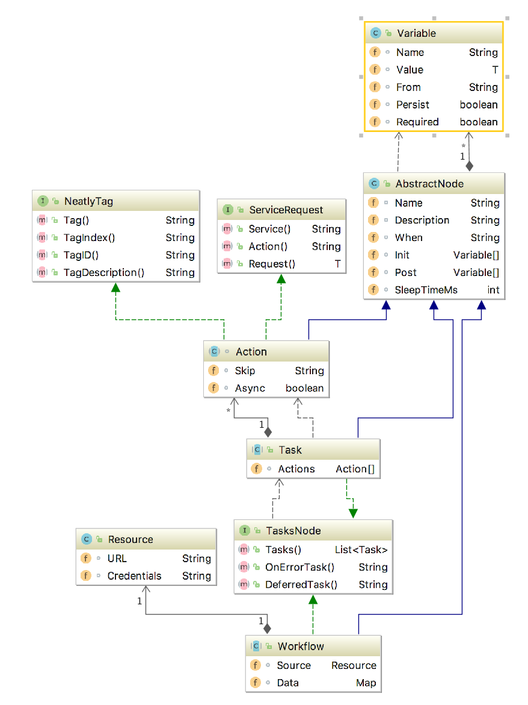

## Workflow 

- [Introduction](#introduction)
- [Workflow format](#format)
- [Workflow process state](#state)
- [Execution control](#control)
- [Lifecycle](#lifecycle)
- [Best Practise](#best)

<a name="introduction"></a>
### Introduction

**[Workflow](../../model/workflow.go)** an abstraction to define a set actions and tasks.




**Task** an abstraction to logically group one or more action, for example, init,test.

**Action** an abstraction defining a call to a service. 
An action does actual job, like starting service, building and deploying app etc, 

**ActionRequest** an abstraction representing a service request.
        
**ActionResponse** an abstraction representing a service response.

To execute action:
1) workflow service looks up a service by id, in workflow manager registry.
2) workflow service creates a new request for corresponding action on the selected service.
3) Action.Request is expanded with context.State ($variable substitution) and converted as service request struct.
4) Service executes operation for provided request.


**[Service](../../service.go)** an abstraction providing set of capabilities triggered by specified action/request.

To list endly supported services run the following:
```bash
endly -s='*'
```

To list supported services actions run the following ```endly -s=[service name]```:

i.e
```bash
endly -s='storage' 
```

To list request/response contract for a service action run the following ```endly -s=[service name] -a=[action]```:

i.e
```bash
endly -s='storage' -a='copy' 
```


**State** key/value pair map that is used to mange state during the workflow run. 
The state can be change by providing variable definition.
The workflow content, data structures, can use dollar '$' sign followed by variable name 
to get its expanded to its corresponding state value if the key has been present.
 

<a name="format"></a>
### Format


*Inline Workflow*

For simple sequential tasks, workflow can be defined inline with [pipeline](../pipeline) run request.

i. e.

@data.yaml


```yaml
defaults:
  datastore: db1
pipeline:
  register:
    action: dsunit:register
    datastore: db1
    config:
      driverName: postgres
      descriptor: host=127.0.0.1 port=5432 user=[username] password=[password] dbname=[dbname]
        sslmode=disable
      credentials: $pgCredentials
      parameters:
        dbname: db1
  prepare:
    mapping:
      action: dsunit.mapping
      mappings:
      - URL: regression/db1/mapping.json
      post:
        tables: $Tables
    sequence:
      action: dsunit.sequence
      tables: $tables
      post:
      - seq = $Sequences
    data:
      action: nop
      init:
      - key = data.db.setup
      - dbSetup = $AsTableRecords($key)
    setup:
      action: dsunit:prepare
      URL: regression/db1/data/
      data: $dbSetup

```


*Neatly*

For more complex workflow endly uses [Neatly](https://github.com/viant/neatly) format 
to represent a workflow. In that case neatly is responsible for converting a tabular document (.csv) 
with json/yaml and other sub path dependencies into workflow object tree as shown in the [diagram](diagram.png).


Find out more about neatly:
[Neatly introduction](https://github.com/adrianwit/neatly-introduction)


To see neatly converted workflow  [*model.Workflow](../../model/workflow.go) run the following


i.e.
@regression.csv

|**Workflow**| | |**Name**|**Description**|**Tasks**| | |**Init**| |
|---|---|---|---|---|---|---|---|---|---|
| | |regression|$app app regresion test|%Tasks| | | @var/init| |
|[]**Tasks**| | |**Name**|**Description**|**Actions**| | | | |
| | |prepare|prepare data for test use cases|%Prepare| | | | |
|[]**Prepare**| |**Service**|**Action**|**Description**|**Request**| | | | |
| |workflow|run|init selenium|@req/selenium_init| | | | |
| |workflow|run|init test data|@req/data| | | | |
|[]**Tasks**| | |**Name**|**Description**|**Actions**| | | | |
| | |test|Defines test requests|%Test| | | | |
|[]**Test{1..002}**|**Subpath**|**Service**|**Action**|**Description**|**Request**|**Skip**|**When**|**Init**|**/Data.db.[]setup**|**TagDescription**
|use_cases/${index}*| |nop|skip this group if skip.txt is present|{}|$HasResource(${subPath}/skip.txt):true| | @var/test_init| |@use_case.txt
|use_cases/${index}*| |nop|push test data|{}| |$HasResource(${subPath}/db1_data.json):true| | @db1_data|
|use_cases/${index}*|selenium|run|run selenium test| @selenium_test| | | | |
|use_cases/${index}*|http/runner|send|run HTTP test| @http_test| | | | |
|use_cases/${index}*|rest/runner|send|run REST test| @rest_test| | | | |
|[]**Tasks**| | |**Name**|**Description**|**Actions**| | | | |
| | |clean|stop test services|%Clean| | | | |
|[]**Clean**| |**Service**|**Action**|**Description**|**Request**|**SleepTimeMs**| | | |
| | |nop|sleep for easy debuging|{}|1000| | | |
| | |run|close and stop seleniun|@req/selenium_destroy| | | | |


*Printing workflow model representation*

```bash

endly -w=WORKFLOW_NAME -p   -f=yaml|json

```


<a name="data-flow"></a>
### Workflow data flow

#### Workflow arguments 
For sake of illustrating data flow, let assume **p1** and **p2** parameters are supplied to workflow.
These can be accessed within workflow or its tasks or actions vi the following:
   - $params.**p1**
   - $params.**p2**

A test workflow can be invoked by one of the following methods:

1) Command line:

```bash
endly -w=test p1=val1 p2=val2
```
2) Single workflow run request

```bash
endly -r=run
```

@run.yaml
```bash
Name: test
Params:
  p1: val1
  p2: val2
```

2) Inline workflow run request:

```bash
 endly -r=run p2=val2
```

@run.yaml
```bash
params:
  p1: val1
pipeline:
  task1:
    action: print
    message: $params.p1 $params.p2
  task2:
    workflow: test
    p1: $params.p1
    p2: $params.p2  
```


<a name="state"></a>
### Workflow process state

Workflow process uses context.State() to maintain execution state.

**[Variables](variable.go)** an abstraction having capabilities to change a workflow state.

A workflow variable defines data transition between input and output state map.


In most cases input and output state is the same underlying map stored in context.State().

In the following cases  input and output state refer to different maps:
    - _post action execution_ 
        - input state map is build from actual action response i.e http send response
        - output is context.State()
    - _post workflow execution_
        - input state map is context.State()
        - output is workflow.RunResponse.Data map 
    
Workflow context.State() is shared between all sub workflows if SharedStateMode is set in workflow.RunRequest.
This flag is set by default to all inline workflow invocation. 


In the inline workflow you can use define variables in the 'init' section


@var.yaml

 ```yaml
pipeline:
  task1:
    init:
      - '!var1 = $params.greeting'
      - var2 = world
      - name: var3
        value:
          - 1
          - 2
      - var4 = $Len($var3) > 0 ? var3.length is $Len($var3) : nil
    action: print
    message: $var1 $var2 $var3 $var4
  task2:
    init:
      var0: abc
      varSlice:
        - 1
        - 2
        - 3   
      varMap:
         k1: v1
         k2: $var0
         k3: $varSlice
    action: print
    message: $varMap 
```


```bash
endly -r=test_var p1=hello 
```

For more advanced usage you can also delegate variable declaration to a separate JSON file  

i.e:

@var.json
```json

[

  {
    "Name": "catalinaOpts",
    "From": "params.catalinaOpts",
    "Value": "-Xms512m -Xmx1g -XX:MaxPermSize=256m"
  },
  {
     "Name": "buildRequest",
     "Value": {
       "BuildSpec": {
         "Name": "maven",
         "Version":"$mavenVersion",
         "Goal": "build",
         "BuildGoal": "$buildGoal",
         "Args": "$buildArgs",
         "Sdk": "jdk",
         "SdkVersion": "$jdkVersion"
       },
       "Target": "$buildTarget"
     }
   }
]
```
    


Variable has the following attributes
* **Name**: name can be defined as key to be stored in state map or expression 
    * array element push **->**, for instance ->collection, where collection is a key in the state map      
    * reference **$** for example $ref, where ref is the key in the state, in this case the value will be 

* **Value**: any type value that is used when from value is empty
* **From**  name of a key state key, or expression with key.
* **When**  criteria if specified this variable will be set only if evaluated criteria is true (it can use $in, and $out state variables)
* **Required** flag that validates that from returns non empty value or error is generated
* **Replace**  replacements map, if specified substitute variable value with corresponding value.

    
The following expression are supported:

- number increments  **++**, for example  counter++, where counter is a key in the state
- array element shift  **<-**, for example  <-collection, where collection is a key in the state      
- reference **$** for example $ref, where ref is the key in the state, in this case the value will be 
- evaluated as value stored in key pointed by content of ref variable
- embedding UDF

    
**Variable in actions:**


| Operation | Variable.Name | Variable.Value | Variable.From | Input State Before | Input State After | Out State Before | Out State  After |
| --- | --- | --- | ---- | --- | --- | --- | --- |
| Assignment | key1 | [1,2,3] | n/a | n/a | n/a | { } |{"key1":[1,2,3]}|
| Assignment by reference | $key1  | 1 | n/a| {"key1":"a"} | n/a | { } | {"a":1} |
| Assignment | key1 | n/a | params.k1 | {"params":{"k1":100}} | n/a | { } | {"key1":100} |
| Assignment by reference | key1  | n/a | $k | {"k":"a", "a":100} |n/a |  { } | {"key1":100} |
| Push | ->key1 | 1 | n/a | n/a | n/a | { } | {"key1":[1]} | 
| Push | ->key1 | 2 | n/a | n/a | n/a | {"key1":[1]} | {"key1":[1,2]} | 
| Shift | item | n/a  | <-key1 | n/a | n/a | {"key1":[1, 2]} | {"key1":[2], "item":1} | 
| Pre increment | key | n/a | ++i |  {"i":100} |  {"i":101}   | {} | {"key":101} } 
| Post increment | key | n/a | i++ | {"i":100} |  {"i":101}   | {} | {"key":100} } 


    
<a name="control"></a>
### Workflow execution control:
By default, workflow run all specified task, and subtask with sync actions sequentially.
All async action are executed independently, task completes when all actions execution is completed.

Each action can control its execution with

**Action level criteria control**

Each action has the following fields supports [conditional expression](../../criteria) to control workflow execution

1. When: criteria to check if an action is eligible to run
2. Skip: criteria to check if the whole group of actions by TagID can be skipped, continuing execution to next  group
3. Repeater control

    
```go
    type Repeater struct {
    	Extracts     Extracts //textual regexp based data extraction
    	Variables    Variables       //structure data based data extraction
    	Repeat       int             //how many time send this request
    	SleepTimeMs  int             //Sleep time after request send, this only makes sense with repeat option
    	Exit string          //Repeat exit criteria, it uses extracted variable to determine repeat termination 
    }
````
    

        
**Workflow goto task action**
Workflow goto action terminates current task actions execution to start specified current workflow task.`

**Workflow switch action** 
Workflow switch action enables to branch execution based on specified context.state key value. 
Note that switch does not terminate next actions within current task.

**Error handling**
If there is an error during workflow execution, it fails immediately unless OnErrorTask is defined to catch and handle an error.
In addition, error key is placed into the config with the following content:

```go
type WorkflowError struct {
	Error        string
	WorkflowName string
	TaskName     string
	Activity     *WorkflowServiceActivity
}
```


**Finally** 
Workflow also offers DeferTask to execute as the last workflow step in case there is an error or not, for instance, to clean up a resource.


 
 <a name="lifecycle"></a>
#### Workflow Lifecycle

1) New context with a new state map is created after inheriting values from a caller. (Caller will not see any state changes from downstream workflow)
2) **data** key is published to the context state with defined workflow.data. Workflow data field would stores complex nested data structure like a setup data.
2) **params** key is published to state map with the caller parameters
3) Workflow initialization stage executes, applying variables defined in Workflow.Pre (input: workflow state, output: workflow state)
4) Tasks Execution 
    1) Task eligibility determination: 
        1) If specified tasks are '*' or empty, all task defined in the workflow will run sequentially, otherwise only specified
        2) Evaluate When if specified
    2) Task initialization stage executes, applying variables defined in Task.Pre (input: workflow  state, output: workflow state)
    
    3) Executes all eligible actions:
        1) Action eligibility determination:
            1) Evaluate When if specified, or Skip for all the actions within the same neatly TagID (tag + Group  + Index + Subpath)
        2) Action initialization stage executes,  applying variables defined in Action.Pre (input: workflow  state, output: workflow  state)
        3) Executing action on specified service
        4) Action post stage executes applying variables defined in Action.Post (input: action.response, output: workflow state)
            response converted to map is also published to workflow state under key defined by COALESCE(action.Name, action.Action)
            
    4) Task post stage executes, applying variables defined in Task.Post (input: state, output: state)   
5) Workflow post stage executes, applying variables defined in Workflow.Post (input: workflow  state, output: workflow.response)
6) Context state comes with the following build-in/reserved keys:
   	* rand - random int64
   	* date -  current date formatted as yyyy-MM-dd
   	* time - current time formatted as yyyy-MM-dd hh:mm:ss
   	* ts - current timestamp formatted  as yyyyMMddhhmmSSS
   	* timestamp.XXX - timestamp in ms where XXX is time diff expression i.e 3DaysAgo, tomorrow, hourAhead 
   	* unix.XXX - timestamp in sec where XXX is time diff expression i.e 3DaysAgo, tomorrow, hourAhead
   	* tzTime.XXX - RFC3339 formatted time where XXX is time diff expression i.e 3DaysAgo, tomorrow, hourAhead
   	* tmpDir - temp directory
   	* uuid.next - generate unique id
   	* uuid.Get - returns previously generated unique id, or generate new
   	* env.XXX where XXX is the ID of the env variable to return
   	* registered user defined function [UDFs](../udf)


         
<a name="best"></a>
## Best Practice

1) Delegate a new workflow request to dedicated req/ folder
2) Variables in  Init, Post should only define state, delegate all variables to var/ folder
3) Flag variable as Required or provide a fallback Value
4) Use [Tag Iterators](https://github.com/viant/neatly#tagiterator) to group similar class of the tests 
5) Since JSON inside a tabular cell is not too elegant, try to use [Virtual object](https://github.com/viant/neatly#vobject) instead.
6) Organize sequential simple tasks [into inline workflow](../pipeline).
7) Organize functionally cohesive complex tasks into workflows. 


Here is an example directory layout.

```text

      endly
        |- manager.csv or run.yaml
        |- system.yaml              
        |- app.yaml
        |- datastore.yaml
        |
        |- system / 
        | - regression /
        |       | - regression.csv
        |       | - var/init.json (workflow init variables)
        |       | - <use_case_group1> / 1 ... 00X (Tag Iterator)/ <test assets>
        |       | 
        |       | - <use_case_groupN> / 1 ... 00Y (Tag Iterator)/ <test assets>
        | - config /
        |       
        | - datastore /
                 | - dictionary /
                 | - schema.ddl
    
```