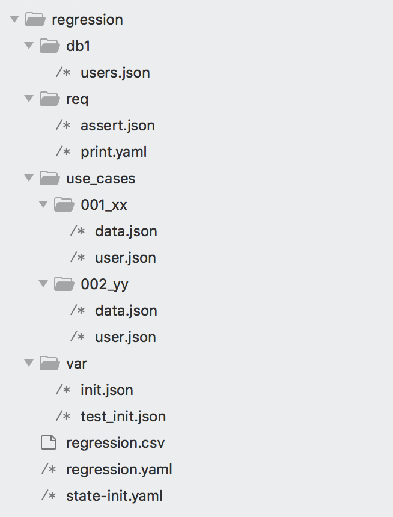

# Datastore services

- [Usage](#usage)
    - [Registering datastore with driver info](#register)
    - [Creating database with schema and loading static data](#schema_and_loading)
    - [Loading data into data store](#loaddata)
    - [Creating setup or verification dataset from existing datastore](#freeze)
    - [Comparing SQL based data sets](#compare)
    - [Using data table mapping](#mapping)
    - [Validating data in data store](#validation)
- [Datstore Credentials](#credentials)
- [Supported databases](#databases)


Datastore service uses [dsunit](https://github.com/viant/dsunit/) service to create, populate, and verify content of datastore. 


| Service Id | Action | Description | Request | Response |
| --- | --- | --- | --- | --- |
| dsunit | register | register database connection |  [RegisterRequest](https://github.com/viant/dsunit/blob/master/contract.go#L46) | [RegisterResponse](https://github.com/viant/dsunit/blob/master/contract.go#70)  |
| dsunit | recreate | recreate database/datastore |  [RecreateRequest](https://github.com/viant/dsunit/blob/master/contract.go#L76) | [RecreateResponse](https://github.com/viant/dsunit/blob/master/contract.go#98)  |    
| dsunit | sql | run SQL commands |  [RunSQLRequest](https://github.com/viant/dsunit/blob/master/contract.go#L103) | [RunSQLResponse](https://github.com/viant/dsunit/blob/master/contract.go#126)  |
| dsunit | script | run SQL script |  [RunScriptRequest](https://github.com/viant/dsunit/blob/master/contract.go#L132) | [RunSQLResponse](https://github.com/viant/dsunit/blob/master/contract.go#126)  |
| dsunit | mapping | register database table mapping (view), |  [MappingRequest](https://github.com/viant/dsunit/blob/master/contract.go#L155) | [MappingResponse](https://github.com/viant/dsunit/blob/master/contract.go#217)  |
| dsunit | init | initialize datastore (register, recreate, run sql, add mapping) |  [InitRequest](https://github.com/viant/dsunit/blob/master/contract.go#L225) | [MappingResponse](https://github.com/viant/dsunit/blob/master/contract.go#286)  |
| dsunit | prepare | populate databstore with provided data |  [PrepareRequest](https://github.com/viant/dsunit/blob/master/contract.go#L293) | [MappingResponse](https://github.com/viant/dsunit/blob/master/contract.go#323)  |
| dsunit | expect | verify databstore with provided data |  [ExpectRequest](https://github.com/viant/dsunit/blob/master/contract.go#L340) | [MappingResponse](https://github.com/viant/dsunit/blob/master/contract.go#380)  |
| dsunit | query | run SQL query |  [QueryRequest](https://github.com/viant/dsunit/blob/master/contract.go#L407) | [QueryResponse](https://github.com/viant/dsunit/blob/master/contract.go#419)  |
| dsunit | sequence | get sequence values for supplied tables |  [SequenceRequest](https://github.com/viant/dsunit/blob/master/contract.go#L388) | [SequenceResponse](https://github.com/viant/dsunit/blob/master/contract.go#400)  |
| dsunit | freeze | create a dataset from existing datastore |  [FreezeRequest](https://github.com/viant/dsunit/blob/master/contract.go#L453) | [FreezeResponse](https://github.com/viant/dsunit/blob/master/contract.go#463)  |
| dsunit | dump | create DDL schema from existing databasse|  [DumpRequest](https://github.com/viant/dsunit/blob/master/contract.go#L470) | [DumpResponse](https://github.com/viant/dsunit/blob/master/contract.go#477)  |
| dsunit | compare | compare data based on SQLs for various databases|  [CompareRequest](https://github.com/viant/dsunit/blob/master/contract.go#L504) | [CompareResponse](https://github.com/viant/dsunit/blob/master/contract.go#540)  |


<a name="usage"></a>
## Usage

<a name="register"></a>
**Registering datastore with driver info**

In order to operate on any data store the first step is to register named data store with specific driver:


```bash
endly -r=register
```


@register.yaml
```yaml
pipeline:
  db1:
    register:
      action: dsunit:register
      datastore: db1
      config:
        driver: mysql
        dsn: '[username]:[password]@tcp(127.0.0.1:3306)/[dbname]?parseTime=true'
        credentials: $mysqlCredentials
        parameters:
          dbname: db1

```


<a name="schema_and_loading"></a>
- **Creating database with schema and loading static data**

```bash
endly -r=init
```

@init.yaml

```bash
pipeline:
  create-db:
    db1:
      action: dsunit:init
      datastore: db1
      recreate: true
      config:
        driver: mysql
        dsn: '[username]:[password]@tcp(127.0.0.1:3306)/[dbname]?parseTime=true'
        credentials: mysql
      admin:
        datastore: mysql
        config:
          driver: mysql
          dsn: '[username]:[password]@tcp(127.0.0.1:3306)/[dbname]?parseTime=true'
          credentials: mysql
      scripts:
      - URL: datastore/db1/schema.sql
  prepare:
    db1:
      action: dsunit:prepare
      datastore: db1
      URL: datastore/db1/dictionary

```

In this scenario above workflow  
1) create or recreate mysql database db1, using mysql connection, 
2) execute schema DDL script to finally 
3) loads static data from datastore/db1/dictionary relative directory, where each file has to match a table name in db1 datastore, json and csv format are supported.

In this case dsunit.init also register datastore with driver thus no need to register it with separate workflow task.


<a name="loaddata">&nbsp;</a>
- **Static data loading into a data store**

Assuming that register or init task has already taken place within the same e2e workflow session


@prepare_db1.yaml
```bash
pipeline:
  prepare:
    db1:
      action: dsunit:prepare
      datastore: db1
      URL: datastore/db1/dictionary
 ```

- When **URL** attribute is used:  each file has to match a table name in db1 datastore and have json and csv extension.

    
- **Dynamic use case data loading into a datastore**
    
 
In many system where data is managed and refreshed by central cache service loading data per use case is very inefficient, to address this problem 
data defined on individual use case level can be loaded to database before individual use cases run. In this scenario 
workflow.Data attribute is used operate any arbitrary data structure.


Assume the [regression](regression) is a folder with the the following structure:

[](regression)

where:

[@state-init.yaml](regression/state-init.yaml) defines an [inline workflow](./../../doc/inline) taking care of registering and loading data defined on use cases level.

```yaml
pipeline:
  db1:
    register:
      comments: register db1 database name with mysql driver
      action: dsunit:register
      datastore: db1
      config:
        driver: mysql
        dsn: '[username]:[password]@tcp(127.0.0.1:3306)/[dbname]?parseTime=true'
        credentials: $mysqlCredentials
        parameters:
          dbname: db1
    prepare:
      setup:
        comments: loads static data,
                     in this scenario in db1/ tehre is only users.json  file
                     it contains JSON array with the first empty map element - which will instruct db unit to remove all users data
        datastore: db1
        action: dsunit:prepare
        URL: db1/

      sequence:
        comments: read sequence for supplied tables and publish it to 'seq' variable (workflow state key)
        action: dsunit.sequence
        datastore: db1
        tables:
        - users
        post:
          - seq = $Sequences
      data:
        comments: convert use case level @data with AsTableRecords UDF,
                  converted table records set 'db1Setup' variable
                  AsTableRecords also pushes data dsunit.${tagId}_users slice
        action: nop
        init:
          - db1key = data.db1
          - db1Setup = $AsTableRecords($db1key)
      load:
        comments: insert data from db1Setup to db1 database
        action: dsunit:prepare
        datastore: db1
        data: $db1Setup
```    


_Inline workflow format:_

[@regression.yaml](regression/regression.yaml) defines regression inline workflow.

```yaml
init:
  mysqlCredentials: mysql

pipeline:
  prepare:
    action: run
    request: '@state-init'
  test:
    range: 1..002
    subPath: use_cases/${index}_*
    data:
      '[]db1': '@data'
    template:
      load-user:
        comments: init section shift data loaded to datbase with sequences
                  published by AsTableRecords UDF, and assign it to user variable
        action: print
        init:
          - name: user
            from: <-dsunit.${tagId}_users
        message: "loaded user: id: $user.id, email: $user.email"
      check:
        action: validator:assert
        actual: $user
        request: '@req/assert @user'
```    

```bash
endly -r=regression.yaml
```  


### Managing Data with Autogenerated Values

Loading test data into a database that utilizes an auto-incrementing/UUID primary key presents a challenge:
as the  value is unknown ahead of time. This becomes particularly relevant when testing operations
that requires autogenerated values to perform  specific operation, necessitating precise knowledge of the data inserted.
To effectively handle this scenario, it's crucial to meticulously organize test data in alignment with the targeted use case.
Addressing the challenge of unknown primary key values, dsunit offers a solution by enabling the capture of current sequence values for specified tables. 
These values are then made available as variables within the workflow's state, facilitating dynamic reference to newly inserted records. 
This method allows for precise and flexible test data management, ensuring that automated tests can be conducted efficiently and accurately.


The following workflow demonstrates the process of capturing sequence values and preparing data for testing:


```yaml
pipeline:
  register:
    action: dsunit:register
    description: "Register the datastore 'db1' with MySQL DSN"
    datastore: db1
    config:
      driver: mysql
      dsn: 'root:dev@tcp(127.0.0.1:3306)/db1?parseTime=true'

  loadSequences:
    action: dsunit:sequence
    description: "Retrieve sequence values for specified tables in 'db1'"
    datastore: db1
    tables: $StringKeys(${data.dbsetup})
    post:
      - sequencer: $Sequences

  printSequences:
    action: print
    message: "Sequences captured: $AsJSON($CaptureSequences)"

  prepareData:
    action: nop
    description: "Prepare data records from setup data"
    init:
      - data_dbsetup = data.dbsetup
      - records = $AsTableRecords(${data_dbsetup})
  
  recordInfo:
    action: print
    description: "Print prepared records for verification"
    message: $AsJSON($records)

  populate:
    when: $Len($records) > 0
    action: dsunit:prepare
    description: "Populate 'db1' with prepared data records"
    datastore: db1
    data: $AsTableRecords('data.dbsetup')


  test:
    tag: $pathMatch
    data:
      ## each use test case folder create a prepare folder with files representing tables data to be loaded
      '[]dbsetup': '@prepare'
    subPath: 'regression/cases/${index}_*'
    range: 1..003
    template:
      checkSkip:
        action: nop
        description: "Initial setup for each test case"
        skip: $HasResource(${path}/skip.txt)
```


#### Defining Test Data:

At this initial stage, test data is systematically organized into JSON files, with each file corresponding to a specific database table. 
For coherence and clarity, this test data is stored in a 'prepare' folder within each use case directory. 
This organization allows each test case to be explicitly linked with its requisite data.


Example JSON structure for **CI_CONTACTS** table data:
```json
[
{
"ID": "$sequencer.CI_CONTACTS/${tag}.1",
"ACCOUNT_ID": 197,
"FIRST_NAME": "Dept",
"PHONE": "PHONE_2",
"STR_ID": "STR_ID_${sequencer.CI_CONTACTS}"
},
{
"ID": "$sequencer.CI_CONTACTS/${tag}.2",
"ACCOUNT_ID": 197,
"PHONE": "PHONE_2",
"STR_ID": "STR_ID_${sequencer.CI_CONTACTS}"
}
]
```
Example JSON structure for **CI_CONTACTS** table data:

[CI_CONTACTS.json](sequences/CI_CONTACTS.json )
```json
  [
    {
      "USER_ID": "$sequencer.CI_CONTACTS/${tag}.1",
      "AUTHORITY": "ROLE_BUSINESS_OWNER",
      "CREATED_USER": 10
    },
    {
      "USER_ID": "$sequencer.CI_CONTACTS/${tag}.2",
      "AUTHORITY": "ROLE_BUSINESS_OWNER",
      "CREATED_USER": 11
    }
  ]
```

Where:
- tag will be replaced with the test case tag
- sequencer is global variable that holds sequence values for each table
- /${tag}.1 is used to generate unique id link as cross file reference
- after AsTableRecords UDF is used to convert data to table records,  each record within each test case can be accessible by $CI_CONTACTS.${tag}.X expression

#### Database/DSN Registration:

The process begins with the registration of a MySQL datastore named 'db1' using DSUnit. 
This step involves specifying the necessary driver and DSN configuration for establishing the database connection.

#### Sequence Loading:

Subsequently, the workflow retrieves and captures the current sequence values for specified tables within 'db1'.
These captured sequence values are stored as workflow variables, facilitating their dynamic utilization in subsequent stages.
Sequence Printing:

For verification and debugging, the captured sequence values are printed in JSON format, providing a clear reference point for further actions.

####  Data Preparation:
This critical stage prepares the data records for testing, converting the setup data into a format suitable for database insertion. This involves creating a variable to hold the setup data and transforming it into table records.

####  Data Population:
Before proceeding, the workflow verifies the presence of records to insert. If records are available, it populates 'db1' with the prepared data, thus aligning the test database with the desired testing state.
Testing:
Facilitating the execution of tests, the workflow loads setup data from the 'prepare' folder corresponding to each test case directory. It iterates through test cases based on a specified range and subpath pattern, incorporating a mechanism to conditionally execute tests based on the existence of a 'skip.txt' file within the test case directory.


<a name="freeze">&nbsp;</a>
**Creating DDL schema from existing datastore**

```bash
endly -r=dump.yaml 
```

@dump.yaml
```yaml
pipeline:
  db1:
    register:
      action: dsunit:register
      datastore: db1
      config:
        driver: mysql
        dsn: '[username]:[password]@tcp(127.0.0.1:3306)/[dbname]?parseTime=true'
        credentials: $mysqlCredentials
        parameters:
          dbname: db1
    reverse-engineer:
      action: dsunit:dump
      datastore: db1
      tables:
        - users       
```


<a name="freeze">&nbsp;</a>
**Creating setup or verification dataset from existing datastore**


```bash
endly -r=freeze.yaml 
```


@freeze.yaml
```yaml
pipeline:
  db1:
    register:
      action: dsunit:register
      datastore: db1
      config:
        driver: mysql
        dsn: '[username]:[password]@tcp(127.0.0.1:3306)/[dbname]?parseTime=true'
        credentials: $mysqlCredentials
        parameters:
          dbname: db1
    reverse-engineer:
      action: dsunit:freeze
      datastore: db1
      sql:  SELECT id, name FROM users
      destURL: regression/use_cases/001_xx_case/prepare/db1/users.json       
```


<a name="compare">&nbsp;</a>
**Comparing SQL based data sets**

```bash
endly -r=compare
```

[@compare.yaml](compare.yaml)
```yaml
pipeline:
  register:
    verticadb:
      action: dsunit:register
      datastore: db1
      config:
        driver: odbc
        dsn: driver=Vertica;Database=[database];ServerName=[server];port=5433;user=[username];password=[password]
        credentials: db1
        parameters:
          database: db1
          server: x.y.z.a
          TIMEZONE: UTC
    bigquerydb:
      action: dsunit:register
      datastore: db2
      config:
        driver: bigquery
        credentials: db2
        parameters:
          datasetId: db2
  compare:
    action: dsunit:compare
    maxRowDiscrepancy: 10
    ignore:
      - field10
      - fieldN
    source1:
      datastore: db1
      SQL: SELECT * 
           FROM db1.mytable 
           WHERE DATE(ts) BETWEEN '2018-12-01' AND '2018-12-02' 
           ORDER BY 1

    source2:
      datastore: db2
      SQL: SELECT *
           FROM db1.mytable
           WHERE DATE(ts) BETWEEN '2018-12-01' AND '2018-12-02'
           ORDER BY 1
```


<a name="mapping">&nbsp;</a>
- **Using data table mapping**

Dealing with large data model can be a huge testing bottleneck. 
Dsunit provide elegant way to address by defining [multi table mapping](https://github.com/viant/dsunit/blob/master/docs/README.md#mapping)
    
_Registering mapping_    

@mapping.yaml
```yaml
pipeline:
  mapping:
    datastore: db1
    action: dsunit.mapping
    mappings:
      - URL: regression/db1/mapping.json
```


<a name="validation">&nbsp;</a>
- **Validating data in data store**


Data validation can take place on various level

 - per use case:
 - after all use cases run with data pushed by individual use cases  
 


@expect_db1.yaml
```bash
pipeline:
  assert:
    db1:
      action: dsunit:epxect
      datastore: db1
      URL:  db1/expect
      data: ${data.db1.setup}
```
    
**URL** and **data** attribute works the same way as in data prepare. 


- See [assertly](https://github.com/viant/assertly#validation) and [dsunit](https://github.com/viant/dsunit) for comprehensive validation option
    - Directive and macro
    - Casting
    - Date/time formatting
    - testing any arbitrary data structure including nested and unordered collection 


**Testing tables without primary key contrains**

1. **@fromQuery@** provides ability to defined in expected dataset SQL that returns both columns and rows in the same order as in expected dataset.

expected/user.json
```json
[
  {"@fromQuery@":"SELECT *  FROM users where id <= 2 ORDER BY id"},
  {"id":1, "username":"Dudi", "active":true, "salary":12400, "comments":"abc","last_access_time": "2016-03-01 03:10:00"},
  {"id":2, "username":"Rudi", "active":true, "salary":12600, "comments":"def","last_access_time": "2016-03-01 05:10:00"}
]
```


2. **@indexBy@**  provides ability to defined a unique key to index both actual and expected dataset right before validation
expected/user.json
```json
[
  {"@indexBy@":["id"]},
  {"id":1, "username":"Dudi", "active":true, "salary":12400, "comments":"abc","last_access_time": "2016-03-01 03:10:00"},
  {"id":2, "username":"Rudi", "active":true, "salary":12600, "comments":"def","last_access_time": "2016-03-01 05:10:00"}
]
```

<a name="credentials"></a>
## Datastore credentials

Credential are stored in ~/.secret/CREDENTIAL_NAME.json using [toolobx/cred/config.go](https://github.com/viant/toolbox/blob/master/cred/config.go) format.

For example:

@source_mysql
```json
{"Username":"root","Password":"dev"}
 ```

To generate encrypted credentials download and install the latest [endly](https://github.com/viant/endly/releases) and run the following

```bash
endly -c=mysql
```

For BigQuery: use service account generated JSON credentials  


<a name="databases"></a>
## Supported databases

- any database that provide database/sql golang driver.


Already included drivers with [endly](./../../bootstrap/bootstrap.go) default build.

 - mysql
 - postgresql
 - aerospike
 - bigquery
 - mongo
 - casandra


Tested, but not included drivers with default endly build (cgo dependency):

 - vertica
 - oracle

